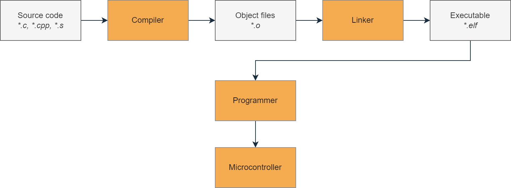
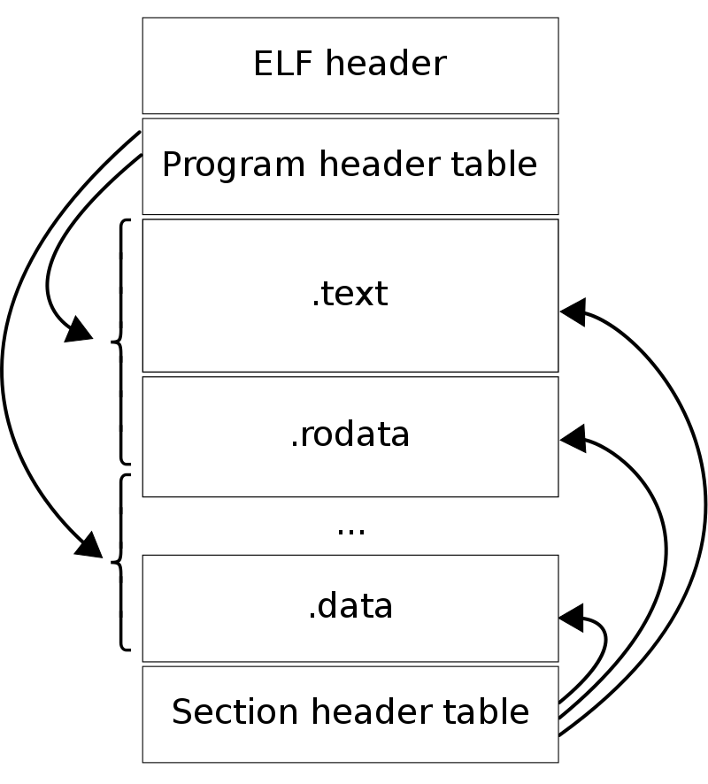
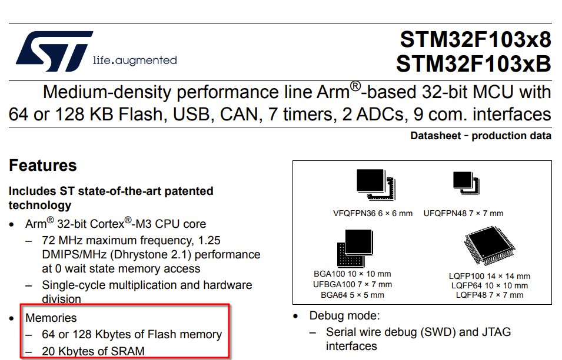
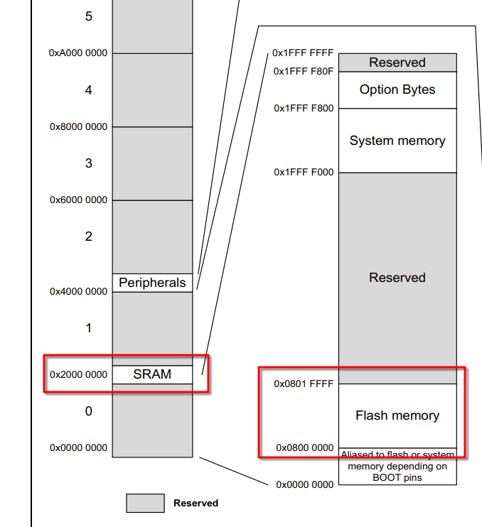
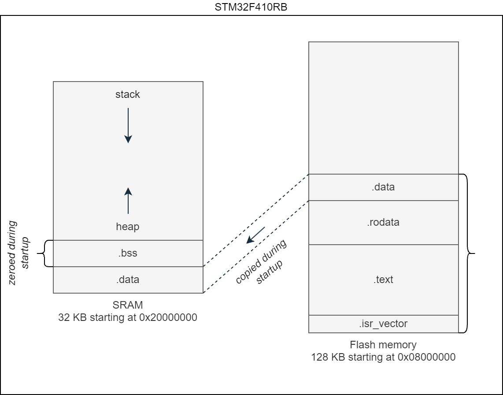
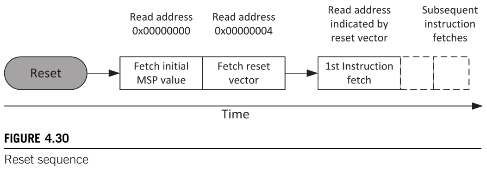
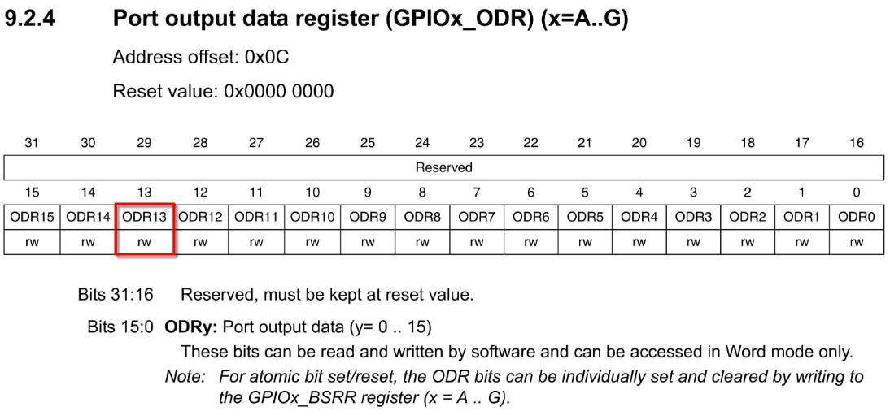
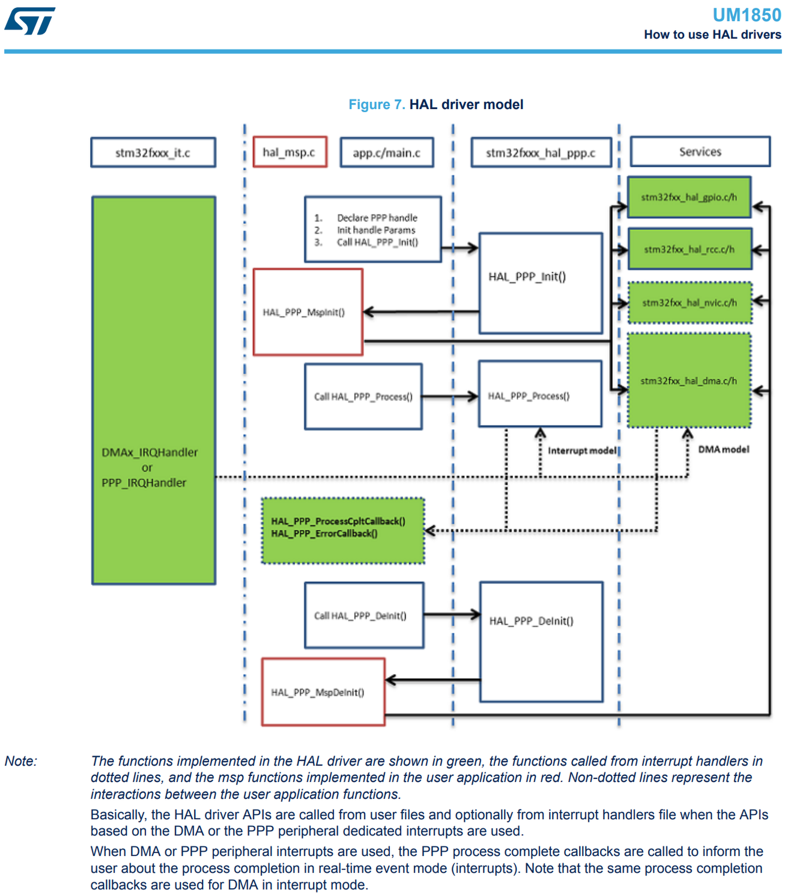

# 从 Bare Metal 到 CubeIDE

本教程是一份 **STM32 裸机编程实践指南**。内容聚焦于在**不依赖任何现成库**的前提下，探索“真正的”裸机开发流程：从最小可运行系统出发，逐步引入必要的抽象与工具，最终过渡到完整的 IDE 与官方生态。

:::tip

什么是裸机编程？

简单来说，裸机编程（Bare Metal Programming）就是**直接运行在 CPU 上的程序**：

- 不依赖操作系统
- 不依赖厂商提供的高层库（例如 STM32 HAL）
- 需要直接操作硬件寄存器

在这种模式下，最重要的参考资料不再是 API 文档，而是 **CPU 架构手册** 和 **MCU 的 Reference Manual** ——其中详细描述了寄存器布局、位定义以及外设工作方式。

可以看下这个 reddit 讨论：https://www.reddit.com/r/embedded/comments/10o0udj/what_is_bare_metal_programming_and_how_to_get/

:::

:::note 声明

本系列主要参考了 [Klein Embedded](https://kleinembedded.com/) 的系列博客，原文基于 `STM32F410RB`，本文在结构和思路保持一致的前提下，针对 `STM32F103C8T6` 做了适当调整和改写。


主要参考链接如下：

+ [Klein Embedded](https://kleinembedded.com/)：
  + [STM32 without CubeIDE (Part 1): The bare necessities](https://kleinembedded.com/stm32-without-cubeide-part-1-the-bare-necessities/)
  
  + [STM32 without CubeIDE (Part 2): CMSIS, make and clock configuration](https://kleinembedded.com/stm32-without-cubeide-part-2-cmsis-make-and-clock-configuration/)
  
  + [STM32 without CubeIDE (Part 3): The C Standard Library and printf()](https://kleinembedded.com/stm32-without-cubeide-part-3-the-c-standard-library-and-printf/)
  
  + [STM32 without CubeIDE (Part 4): CMake, FPU and STM32 libraries](https://kleinembedded.com/stm32-without-cubeide-part-4-cmake-fpu-and-stm32-libraries/)
  

此外，**cpq** 的裸机编程指南同样是非常重要的参考资料：

+ GitHub@**cpq**：[裸机编程指南](https://github.com/cpq/bare-metal-programming-guide/blob/main/README_zh-CN.md)

本文对应的完整示例代码已整理并发布在我的 GitHub 仓库中：https://github.com/WheelsLab/bare-metal-programming-without-CubeIDE.git

:::

整个系列将分为四个部分，循序渐进地构建完整的 STM32 开发环境：

+ 第 1 部分

  编写链接脚本与启动代码（startup code），构建最小可运行程序，并完成一个最基础的 LED 闪烁示例。

+ 第 2 部分

  引入 **CMSIS**，使用 `Make` 实现构建自动化；通过**寄存器级配置**完成系统时钟设置，并使用 **SysTick 定时器**验证时钟是否工作正常。

+ 第 3 部分

  引入 **C 标准库（newlib）**，实现 `printf` 等基础调试手段，理解嵌入式环境中标准库的裁剪与取舍。

+ 第 4 部分

  引入 **HAL / LL 库**，并使用 **CMake** 作为元构建系统，完成从“纯裸机”到现代嵌入式工程结构的过渡。

任何编程开发工作都离不开工具链，其职责是将人类可读的源代码转换为处理器能够执行的指令。

在嵌入式开发中，由于目标处理器架构（如 ARM Cortex-M）与本机架构不同，因此需要使用 **[交叉编译工具链](https://zh.wikipedia.org/wiki/%E4%BA%A4%E5%8F%89%E7%B7%A8%E8%AD%AF%E5%99%A8)** 。本教程使用的是官方维护的 **[GNU Arm Toolchain](https://developer.arm.com/downloads/-/arm-gnu-toolchain-downloads)**，用于生成 Cortex-M 可执行代码。

在 **Arch Linux** 环境下，可通过以下方式安装所需工具：

```shell
$ paru -S arm-none-eabi-gcc \
         arm-none-eabi-binutils \
         arm-none-eabi-gdb \
         arm-none-eabi-newlib \
         openocd \
         cmake
```

+ GNU ARM Toolchain 包含以下内容
  + **`arm-none-eabi-gcc`**：负责编译与链接
  
    - `gcc`：将 C/C++ 代码编译为目标架构的机器码
    - `as`：汇编器，生成目标文件（`.o`）
    - `ld`：链接器，根据链接脚本生成最终可执行文件（`.elf`）
  
  + **`arm-none-eabi-binutils`**：二进制工具集
  
    - `size`：查看 Flash / RAM 占用
  
    - `objcopy`：生成 `.bin` / `.hex` 文件
  
    - `objdump`：反汇编与静态分析
  
  + **`arm-none-eabi-gdb`**：调试器，用于在硬件或仿真环境中调试程序，检查寄存器与内存状态。
  
  + **`arm-none-eabi-newlib`**：嵌入式 C 标准库，是 `glibc` 在嵌入式场景下的轻量级替代方案。

除了编译工具链外，还需要：

- **`cmake`**：元构建系统，用于生成平台相关的构建文件
- **`make`**：实际执行构建任务的工具
- **`openocd`**：烧录与调试接口

在 Arch Linux 上，`make` 包含在 `base-devel` 包组中（如果你已经使用 [AUR](https://wiki.archlinux.org/title/Arch_User_Repository))，通常已安装）：

```shell
# pacman -S base-devel
```

最后，还需要一个代码编辑器。本文示例使用 **[VS Code](https://wiki.archlinux.org/title/Visual_Studio_Code)**，当然你也可以选择 **[Vim](https://wiki.archlinuxcn.org/wiki/Vim)** 或其他熟悉的编辑环境。

```shell
$ paru -S visual-studio-code-bin
```

## 第 1 部分：裸机编程之最小闪灯程序

本节我们将深入底层，通过**手写链接脚本**、**定制启动代码**来实现一个最基础的闪灯程序。

### 构建流程

我们从最精简的工程起步。目标很简单：不依赖任何第三方库，在完全透明的状态下点亮一颗 LED



整个过程通常分为以下阶段：

1. **编译与链接：** 源代码由编译器（Compiler）转换为中间目标文件，再由链接器（Linker）合并为可执行文件。
2. **烧录：** 利用编程器（Programmer）将成品固件写入微控制器的 Flash。
3. **执行：** MCU 上电复位，运行代码。

下面，来看下一个更具体的例子，以了解更多细节。

我们有以下文件：

+ **链接脚本 (`linker_script.ld`)**：定义内存布局。
+ **启动代码 (`startup.c`)**：处理复位向量与环境初始化。
+ **应用程序 (`main.c`)**：逻辑入口。

在执行 `arm-none-eabi-gcc` 时，编译器会将各个 `.c` 文件编译成独立的目标文件 `.o`。紧接着，链接器 `arm-none-eabi-ld` 会介入，**链接脚本**在此扮演“地图”的角色，指引链接器将代码段（.text）和数据段（.data）准确地安置在微控制器内存的指定位置，最终产出 `blink.elf`。

:::note

实际使用时，一般只调用 `gcc`，而不会手动区分“编译”和“链接”。如果需要中间产物，可以通过参数控制，比如`-c` 可以输出目标文件，而不进行链接，`-Wl,-Map=filename.map` 可以输出内存映射文件。

感兴趣的话可以翻一下 GCC 的文档：https://gcc.gnu.org/onlinedocs/gcc/Overall-Options.html#Overall-Options

:::


编译完成后，PC 通过 **OpenOCD** 驱动 **ST-Link**，将二进制数据写入 Flash。 当 MCU 启动时，硬件首先执行启动代码。首先将确保初始化数据段（`.data`）复制到 SRAM，未初始化数据段（`.bss`）填充为零，然后再调用 `main()` 函数，即我们的程序。

:::tip

ELF 是烧录到 MCU flash 中的程序，但 `ELF` 是什么？前面提到的 `blink.elf` 并不是“纯代码”，而是一个带结构的文件。

<details>
<summary>[ELF（Executable and Linkable Format）](https://en.wikipedia.org/wiki/Executable_and_Linkable_Format)，是 UNIX &   Linux 系统中可执行文件、目标文件和共享库的格式。换句话说，编译后的程序（可执行二进制文件）除了真正的指令和数据，还有一些元数据，这些元数据是操作系统加载程序到内存时运行所需的。ELF 文件，分为两个部分，头部（ELF Header）和多个节（Section）。[GNU binutils](https://en.wikipedia.org/wiki/GNU_Binutils) 包括 `objdump`、`nm`、`readelf` 都可以检视 ELF 文件的内容。节（Section）存放代码和数据，典型的节包括 `.text`、`.data`、`.rodata`</summary>



这篇 Wiki 很好的解释了 ELF：https://en.wikipedia.org/wiki/Executable_and_Linkable_Format


想深入的话，可以看看 Wiki：

+ https://linux-audit.com/elf-binaries-on-linux-understanding-and-analysis/#structure
+ https://intezer.com/blog/executable-and-linkable-format-101-part-1-sections-and-segments/

还有一些有意思的讨论：

reddit 讨论，

+ 向不懂技术的人解释 ELF：https://www.reddit.com/r/linuxquestions/comments/17rhr8v/how_would_you_explain_the_linux_elf_format_to_a/

+ ELF 和 BIN 有区别吗？https://stackoverflow.com/questions/2427011/what-is-the-difference-between-elf-files-and-bin-files

速查资料：

+ elf_format_cheatsheet：https://gist.github.com/x0nu11byt3/bcb35c3de461e5fb66173071a2379779

</details>

:::

### 链接脚本——如何安排代码在内存中的位置

链接脚本的工作，可以理解为**给链接器一份内存分布说明**，主要解决三件事：

1. 处理器启动后，程序从哪里开始执行（也就是入口点）。
2. MCU 内部有哪些可用的存储区（memory region）。
3. 不同类型的代码和数据，应该放在内存的什么位置。

链接脚本使用的是链接器自己的命令语言，完整语法可以在 GNU ld 的文档中找到：[这里](https://ftp.gnu.org/old-gnu/Manuals/ld-2.9.1/html_chapter/ld_3.html)。

不过这里用到的内容并不多，理解几个常用指令就足够了。

首先是程序入口点，通过 `ENTRY()` 命令指定。启动代码中会实现一个名为 `reset_handler()` 的函数，用来完成最早期的初始化工作，比如内存拷贝和清零。

```c title="linker_script.ld"
ENTRY(reset_handler)
```

接下来需要弄清楚 MCU 的内存长什么样。Flash 和 SRAM 的大小因型号而异，这些信息需要直接查 **数据手册（Datasheet）**。以 `STM32F103C8T6` 为例，相关参数可以在官方文档中找到：[数据手册 DS5319](https://www.st.com/en/microcontrollers-microprocessors/stm32f103/documentation.html)

后续链接脚本的内容，本质上就是把这些“硬件规格”翻译成链接器能理解的描述，让代码和数据各就各位。



`STM32F103C8T6` 中的 **C8**，按照 ST 的命名规则，对应 **64 KB 的 Flash**；此外从图中可以看到 SRAM 是 20 Kb

继续往数据手册后面翻，在 **第 4 节 Memory Mapping** 中，可以找到更关键的地址信息：

- **SRAM 起始地址**：`0x2000 0000`
- **Flash 起始地址**：`0x0800 0000`




到这里，定义内存区域所需的信息就齐全了。接下来就可以在链接脚本中，用 `MEMORY` 命令把这些信息明确写出来：

```c
MEMORY
{
  FLASH (rx): ORIGIN = 0x08000000, LENGTH = 64K
  SRAM (rwx): ORIGIN = 0x20000000, LENGTH = 20K
}
```

接下来要解决的问题是：**目标文件里的各个段，具体该放进这些内存区域的什么位置？**

先回忆一下前面提到过的内存示意图：



Flash 中第一部分是最前面是 **中断向量表**（ISR, Interrupt Service Routine) `.isr_vector`，默认位于地址 `0x0000 0000`（实际上会映射到 Flash 起始位置）。然后是 `.text` 段，也就是程序指令。然后是 `.rodata`，存放只读数据。最后是 `.data` 其中包含是**有初始值的全局变量**，这些数据在启动时会从 Flash 复制到 SRAM 中。而在 SRAM 中，还会有一个 `.bss` 段，用来存放**未初始化的全局变量**，启动时需要清零

:::note

如果想查看某个 `.elf` 或 `.o` 文件里具体包含哪些段，可以使用：`arm-none-eabi-objdump -h <filename>`

:::

有了这些背景，就可以使用 `SECTIONS` 命令来正式定义各个段的布局了：

```c title="linker_script.ld"
SECTIONS
{
  .isr_vector :
  {
    KEEP(*(.isr_vector))
  } >FLASH

  .text :
  {
    . = ALIGN(4);
		
    *(.text)
    *(.rodata)
		
    . = ALIGN(4);
    _etext = .;
  } >FLASH

  .data :
  {
    . = ALIGN(4);
    _sdata = .;
		
    *(.data)

    . = ALIGN(4);
    _edata = .;
  } >SRAM AT> FLASH

  .bss :
  {
    . = ALIGN(4);
    _sbss = .;
		
    *(.bss)
		
    . = ALIGN(4);
    _ebss = .;
  } >SRAM
}
```

这里有几个关键点值得注意。首先，每个 `SECTION` 后面都会跟一个内存区域说明，比如 `>FLASH` 或 `>SRAM`，用来指定这个段最终放在哪一块内存中。

其中比较特殊的是 **`.data` 段**，它有两个内存地址

+ `>SRAM`：**运行时地址**（VMA，程序执行时访问的地址）

+ `AT> FLASH`：**加载地址**（LMA，数据实际存放的位置）

```
.data : { ... } >SRAM AT> FLASH
```

原因也很直观，SRAM 是易失的，断电就没了，因此 `.data` 的初始值只能先存在 Flash 中；MCU 启动时，再由启动代码把这部分数据复制到 SRAM。

其他所有节都只有一个内存地址（`.text`、`.rodata` 只存在于 Flash、`.bss` 只存在于 SRAM），它们的加载地址和运行地址是同一个，因此不需要额外说明。

此外，在脚本中还定义了一些符号：`_etext`、`_sdata`、`_edata`、`_sbss` 和 `_ebss`，以及用到了位置计数器 `.`。稍后将在启动代码中使用这些符号，以确保复制（`.data`）和清零（`.bss`）正确的内存地址。

链接脚本到这里就告一段落了。

下一步，就是看看启动代码是如何利用这些符号，把 MCU 从“刚上电的状态”带到 `main()` 的。

### 启动代码——在执行 `main()` 之前做好准备

:::tip ARM Cortex-M 启动流程

[The Definitive Guide to ARM® Cortex®-M3 and Cortex®-M4 Processors 3rd Edition](https://www.amazon.com/Definitive-Guide-Cortex%C2%AE-M3-Cortex%C2%AE-M4-Processors/dp/0124080820) 的 4.8 节 Reset and reset sequence 对启动流程有非常详细的说明。

基于 Cortex-M 的 MCU 通常具有三类重置（reset）：

+ Power on reset——上电复位，处理器、调试组件、外设全部重置，相当于“彻底清空重来”。
+ System reset——重置处理器和外设，但调试组件仍然保持状态。
+ Processor reset——只重置处理器核心。

上电后的第一步：**向量表**

在真正开始执行代码之前，处理器会先去内存起始地址 `0x0000_0000` 读取两个 32 位的 word（[word = 32 bit](https://stackoverflow.com/questions/5295903/how-many-bits-does-a-word-contain-in-32-64-bit-os-respectively)）。这里存放的正是 **中断向量表（vector table）** 的前两个条目：

+ **主[栈指针](https://en.wikipedia.org/wiki/Stack_register)（MSP, Main Stack Pointer）**

+ **Reset Vector（reset handler 的入口地址）**

处理器会用这两个值初始化寄存器：MSP 写入 R13，Reset Vector 写入 PC（Program Counter），随后从 reset handler 开始执行。




Cortex-M 使用的是**全递减栈（full descending stack）**，也就是说，**先递减 SP，再写入数据**。因此，SP 的初始值并不是栈的起始地址，而是**栈区上方的第一个字节**。比如，下图中，栈的内存从 `0x20007C00` 到 `0x20007FFF`（共 1 Kbytes），所以 SP 的初始值应当设置为 `0x20008000`（刚好是栈上方的第一个字节）。

还有一个容易忽略的小点，向量表中的函数地址，**最低位（LSB）必须为 1**，用于表示 Thumb 状态。比如，下图中的 reset vector 的值是 `0x101`，但是 reset handler（boot code）的起始地址实际上是 `0x100`。


::::note

栈指针和栈并不是“抽象概念”，函数调用、局部变量分配，底层都依赖它。

+ https://www.reddit.com/r/AskComputerScience/comments/13cf1y0/does_a_cpu_know_about_a_stack_and_a_heap_or_are/
+ https://www.quora.com/What-is-the-stack-in-a-CPU

::::

在 `startup.c` 中，需要做以下事：

+ 初始化位于 `.isr_vector` 段的主栈指针（MSP, main stack pointer）和中断向量表（interrupt vector table）
+ 将 `.data` 段从 Flash 拷贝到 SRAM
+ 将 `.bss` 段清零

主栈指针通常指向 SRAM 末尾的下一个字节。随着函数调用和局部变量压栈，SP 会不断向低地址移动。已知 SRAM 的起始地址和大小后，结束地址就很好算：

```c title="startup.c"
#define SRAM_START (0x20000000U)
#define SRAM_SIZE (20U * 1024U)
#define SRAM_END (SRAM_START + SRAM_SIZE)
#define STACK_POINTER_INIT_ADDRESS (SRAM_END)
```

这个值会被放在向量表的第一个 word 中，上电后由处理器自动加载到 R13。

向量表（vector table）中除了主堆栈指针的值外，还需要 15 个字用于 Cortex-M 的系统异常（System Exception）处理程序。

:::note

向量表本质上就是一个**函数指针数组**。

:::

后续条目对应具体芯片的外设中断对于 `STM32F103C8T6`，一共是 68 个中断向量（见 RM0008）有些字是保留的，只需要填充 0 即可。


RM0008 的 10.1.2 Interrupt and exception vectors 中列出了所有中断。这里只实现两个处理函数： `reset_handler()` 和 `default_handler()`。其他中断全部弱引用到 `default_handler()`，以后需要时再单独实现即可。请注意 `isr_vector[]` 的节属性，以确保位于正确的内存区域。

```c title="startup.c"
#include <stdint.h>
#define ISR_VECTOR_SIZE_WORDS 84

// System Exception handlers
void reset_handler(void);
void default_handler(void);
void nmi_handler(void) __attribute__((weak, alias("default_handler")));
void hard_fault_handler(void) __attribute__((weak, alias("default_handler")));
void bus_fault_handler(void) __attribute__((weak, alias("default_handler")));
void usage_fault_handler(void) __attribute__((weak, alias("default_handler")));
void svcall_handler(void) __attribute__((weak, alias("default_handler")));
void debug_monitor_handler(void) __attribute__((weak, alias("default_handler")));
void pendsv_handler(void) __attribute__((weak, alias("default_handler")));
void systick_handler(void) __attribute__((weak, alias("default_handler")));
// continue adding device interrupt handlers

uint32_t isr_vector[ISR_VECTOR_SIZE_WORDS] __attribute__((section(".isr_vector"))) = {
  STACK_POINTER_INIT_ADDRESS,
  (uint32_t)&reset_handler,
  (uint32_t)&nmi_handler,
  (uint32_t)&hard_fault_handler,
  (uint32_t)&bus_fault_handler,
  (uint32_t)&usage_fault_handler,
  0,
  0,
  0,
  0,
  0,
  (uint32_t)&svcall_handler,
  (uint32_t)&debug_monitor_handler,
  0,
  (uint32_t)&pendsv_handler,
  (uint32_t)&systick_handler,
  // continue adding device interrupt handlers
};

void default_handler(void)
{
  while(1);
}
```

最后我们需要实现 `reset_handler()` 函数，已经在链接脚本中指定为程序入口。这部分，我们会使用链接脚本中的符号，将 `.data` 段（起始于 `_etext`）从 Flash 复制到 SRAM （起始于 `_sdata`），并且把充位于 SRAM 中的 `.bss` 段（从 `._sbss` 到 `_ebss`）清零。

```c title="startup.c"
extern uint32_t _etext, _sdata, _edata, _sbss, _ebss;
void main(void);

void reset_handler(void)
{
  // Copy .data from FLASH to SRAM
  uint32_t data_size = (uint32_t)&_edata - (uint32_t)&_sdata;
  uint8_t *flash_data = (uint8_t*) &_etext;
  uint8_t *sram_data = (uint8_t*) &_sdata;
  
  for (uint32_t i = 0; i < data_size; i++)
  {
    sram_data[i] = flash_data[i];
  }

  // Zero-fill .bss section in SRAM
  uint32_t bss_size = (uint32_t)&_ebss - (uint32_t)&_sbss;
  uint8_t *bss = (uint8_t*) &_sbss;

  for (uint32_t i = 0; i < bss_size; i++)
  {
    bss[i] = 0;
  }
  
  main();
}
```

到这里，运行环境已经准备就绪，程序终于正式进入熟悉的 `main()`。

### 最小闪灯程序

在嵌入式世界里，`main()` 里的 “Hello World” 通常不是打印字符串，而是——**点亮一颗 LED**。

我的开发版上有一个蓝色 LED，正极接 VCC，负极接到 `PC13`，采用的是**开漏（open-drain）接法**。


想让这颗 LED 闪起来，需要做的事情并不复杂：

+ 打开 GPIOC 端口的外设时钟
+ 把 PC13 配置成**开漏输出模式**
+ 在死循环里，按固定间隔翻转引脚电平

要直接操作外设，第一步是弄清楚：**寄存器到底映射在内存的什么位置**。翻开数据手册第 4 章 *Memory Mapping*，可以看到所有外设的基地址都从 `0x4000_0000` 开始，而 GPIOC 位于：

```
0x4001 1000
```


再看参考手册 3.3 *Memory map* 的 Table 3 Register boundary addresses (continued)，可以看到 GPIOC 挂在 **APB2 总线**，地址范围 `0x4001 1000 ~ 0x4001 13FF`，APB2 基地址是 `0x4001_0000`。


我们可以用 `APB2_BaseAddr + PeripheralOffset` 的方式定义该总线上外设的地址。

下面用宏来定义这些地址

```c title="main.c"
#define PERIPHERAL_BASE (0x40000000U)

#define APB2_BASE (PERIPHERAL_BASE + 0x10000U)
#define GPIOC_BASE (APB2_BASE + 0x1000U)
```

外设寄存器能不能用，关键不在地址，而在**时钟有没有打开**，GPIOC 的时钟控制位在 RCC 里。再次看参考手册 3.3 Memory map 中的表格 Table3. Register boundary addresses，可以看到 RCC 地址位于 `0x4002 1000 ~ 0x4002 13FF`，挂在 AHB 总线（`0x4001 8000`）上


先把这些地址也定义出来：

```c title="main.c"
#define AHB_BASE (PERIPHERAL_BASE + 0x18000U)

#define RCC_BASE (AHB_BASE + 0x9000U)
```

然后我们需要开启 GPIOC 的时钟，并把 PC13 配置为输出开漏模式。

先看看如何开启时钟，来看 RCC 寄存器，找到参考手册中的 APB2 外设时钟使能寄存器（8.3.7 APB2 peripheral clock enable register (RCC_APB2ENR) ），其偏移地址是 `0x18`，第 4 个 bit 是 GPIOC 时钟的开关。


再往下翻一点，可以看到向该位写入 1 可以开启时钟


继续定义一些外设时钟的地址，对应的宏可以这样写：

```c title="main.c"
#define RCC_APB2ENR_OFFSET (0x18U)
#define RCC_APB2ENR ((volatile uint32_t*) (RCC_BASE + RCC_APB2ENR_OFFSET))
#define RCC_APB2ENR_GPIOCEN (4U)
```

接下来是 GPIO 本身的配置，我们需要配置其为输出开漏模式，并设置其初始状态为 1（熄灭 LED）。

这可以通过端口配置寄存器（GPIOx_CRL 和 GPIOx_CRH）和输出寄存器（GPIOx_ODR）来配置。

PC13 属于 8~15 号引脚，因此由 `GPIOx_CRH` 寄存器控制。

目标配置是：

- `MODE13 = 0b10` → 输出模式，最大 2 MHz
- `CNF13  = 0b01` → 开漏输出

合起来就是 `0b0110`，对应 CRH 中的 **bit 20~23**。


由于 LED 是低电平点亮，所以还需要把输出寄存器里的 `ODR13` 先置 1，让 LED 默认熄灭。



相关寄存器地址整理如下：

```c title="main.c"
#define GPIO_CRH_OFFSET (0x04U)
#define GPIOC_CRH ((volatile uint32_t*) (GPIOC_BASE + GPIO_CRH_OFFSET))
#define GPIO_CRH_MODE13_CNF13 (20U)

#define GPIO_ODR_OFFSET (0x0CU)
#define GPIOC_ODR ((volatile uint32_t*) (GPIOC_BASE + GPIO_ODR_OFFSET))

#define LED_PIN 13
```

这里的寄存器指针都加了 `volatile`，目的是告诉编译器：**这些内存访问有副作用，别擅自优化掉**。如果对 `volatile` 不熟，这篇文章解释得很清楚：[volatile 的作用](https://kleinembedded.com/the-volatile-qualifier/)

最后，开始写 `main()` 函数，万事俱备，代码就很直白了：

1. 打开 GPIOC 时钟

2. 做两次 dummy read（芯片勘误建议）

3. 配置 PC13 为开漏输出

4. 在循环里翻转引脚电平，加个简单延时

```c title="main.c"
void main(void)
{
  // 外设时钟使能
  *RCC_APB2ENR |= (1 << RCC_APB2ENR_GPIOCEN);

  // do two dummy reads after enabling the peripheral clock, as per the errata
  volatile uint32_t dummy;
  dummy = *(RCC_APB2ENR);
  dummy = *(RCC_APB2ENR);

  *GPIOC_CRH |= (6 << GPIO_CRH_MODE13_CNF13);
  
  while(1)
  {
    *GPIOC_ODR ^= (1 << LED_PIN);
    for (uint32_t i = 0; i < 1000000; i++);
  }

}
```

至此，一个**不依赖任何库、不用 CubeMX、不靠 HAL** 的最小闪灯程序就完成了。

### 构建可执行文件

到这里，源码已经齐活，可以开始把它们真正“捏”成一个能跑的程序了。前面提到过，其实**没必要手动区分编译和链接**，直接调用 `arm-none-eabi-gcc` 就行，它会自动完成整个流程：

```shell
$ arm-none-eabi-gcc main.c startup.c -T linker_script.ld -o blink.elf -mcpu=cortex-m3 -mthumb -nostdlib
```

这条命令做了几件事：

- `main.c startup.c`
   直接把所有源文件丢给编译器。
- `-T linker_script.ld`
   指定自定义的链接脚本，告诉链接器内存该怎么排。
- `-o blink.elf`
   指定最终输出的可执行文件名。
- `-mcpu=cortex-m3 -mthumb`
   明确目标 CPU 架构和指令集（毕竟这是在给另一种 CPU 交叉编译）。
- `-nostdlib`
   不链接标准库，也不使用默认的系统启动代码——启动流程已经完全自己接管了。

命令执行完成后，项目目录下会多出一个 `blink.elf` 文件。这个 ELF 文件，就是接下来要烧进 MCU 的“成品”。

### 把程序加载到微控制器（烧录）

接下来轮到 OpenOCD 出场。OpenOCD 本身并不需要复杂配置，只要告诉它两件事就够了：

+ 使用什么**编程器（interface）**

+ 目标是什么**微控制器（target）**

编程器的配置在 `/usr/share/openocd/scripts/interface/` 中。目标微控制器型号在 `/usr/share/openocd/scripts/target/` 中。OpenOCD 在运行时会自动搜索这些目录，所以命令行只需要引用文件名即可。

要将 `.elf` 烧录到目标设备，只需要找到和我们的板子（STM32F103 + ST-Linkv2）匹配的配置（`interface/stlink.cfg` 和 `target/stm32f1x.cfg`），然后使用 `-c` 选项指定要执行的命令，完整的烧录命令如下：

```
$ openocd -f interface/stlink.cfg -f target/stm32f1x.cfg -c "program blink.elf verify reset exit"
```

这条命令一口气做了四件事：

- 把 `blink.elf` 写入 Flash
- 校验写入内容是否正确
- 复位 MCU
- 干完活直接退出 OpenOCD

如果一切顺利，命令跑完的同时，板子上的 LED 应该已经开始闪烁了。

### 下节预告

纯手写寄存器、地址和位定义，虽然很“硬核”，但写多了确实挺折磨人的。接下来会稍微让事情轻松一点，引入 **CMSIS** 组件，用现成的寄存器定义来代替那些手写的宏——毕竟没必要每次都重复造轮子。同时，也会把那条又长又容易敲错的编译命令收拾一下，用经典的 Unix / Linux 构建工具 **`make`** 写一个简单的 `Makefile`，让构建过程变成一句命令的事。

## 第 2 部分：裸机编程之 ARM 官方库 CMSIS

在上一节中，实现了一个最小可用的闪灯程序——这已经是 STM32 裸机运行所需的**最小集合**了。不过代价也很明显：外设寄存器地址全靠手翻手册，一个一个 `#define`；编译、链接、烧录全都直接在命令行里敲，参数又长又容易写错。

这一节的目标很明确：**把这些“体力活”交给工具来做**。为此，将引入：

- ARM 官方的 **CMSIS Core**（Cortex-M 内核相关定义）
- ST 提供的 **STM32F1 设备头文件**（外设寄存器定义）
- 一个简单的 **Makefile**，让构建过程变成一句命令

顺带还会配置系统时钟，把 LED 闪得更“专业”一点。

### CMSIS 和寄存器定义

回顾第一部分，当需要操作 GPIO 时，只能照着参考手册：

- 查外设基地址
- 算寄存器偏移
- 手写一堆 `#define`

偶尔写写还能接受，如果每个外设都这么来，很快就会进入“复制—粘贴—怀疑人生”的阶段。好消息是，这件事早就有人替你做完了。

**CMSIS（Common Microcontroller Software Interface Standard）** 是 ARM 为 Cortex-M 系列定义的一套标准组件集合，主要包括：

- Cortex-M 内核寄存器与核心外设定义
- 一些通用的内联函数与抽象接口
- 可选的 DSP / RTOS 相关支持

在此基础上，ST 又提供了 **STM32 的设备组件**，把每个外设的寄存器都封装成了结构体和宏。

:::note 相关仓库：

+ CMSIS Core（内核定义）：https://github.com/ARM-software/CMSIS_5
+ STM32F1 CMSIS Device（外设定义）：https://github.com/STMicroelectronics/cmsis-device-f1

:::

先在项目中创建一个 `vendor` 目录，用来放第三方代码。然后把 CMSIS Core 和 STM32F1 设备组件添加到我们的项目。

```shell
mkdir vendor
cd vendor
git clone https://github.com/ARM-software/CMSIS_5 CMSIS
```

接下来，在 `CMSIS/Device` 下创建 ST 目录，并克隆 STM32F1 的设备组件：

```
cd CMSIS/Device
mkdir ST
cd ST
clone https://github.com/STMicroelectronics/cmsis_device_f1 STM32F1
```

此时你可能已经注意到了，**CMSIS 非常大**（轻松几百 MB），因为它包含了所有架构、所有厂商的组件。

实际上这里只需要两部分：

- `CMSIS/CMSIS/Core`
- `CMSIS/Device/ST/STM32F1`

其他内容（包括 `.git` 目录）都可以放心删掉，完全不影响后续使用。

使用 CMSIS 后，访问寄存器的方式会发生质变。

```c
#include "stm32f1xx.h"
```

这个头文件会根据 MCU 型号自动包含正确的设备定义（比如 `stm32f103xb.h`）。前提是 **告诉编译器当前使用的具体芯片型号**，可以通过：

- 在代码中 `#define STM32F103xB`
- 或在编译时使用 `-DSTM32F103xB`

有了这些定义，第一部分里那些手写的外设地址宏就可以全部删除了。修改后的 `main.c` 看起来会清爽很多：

```c title="main.c"
#include "stm32f1xx.h"
#include <stdint.h>

void main(void)
{

  // 外设时钟使能
  RCC->APB2ENR |= (1 << RCC_APB2ENR_IOPCEN_Pos);

  // do two dummy reads after enabling the peripheral clock, as per the errata
  volatile uint32_t dummy;
  dummy = RCC->APB2ENR;
  dummy = RCC->APB2ENR;

  GPIOC->CRH = (GPIOC->CRH & ~GPIO_CRH_MODE13_Msk) | GPIO_CRH_MODE13_1;
  GPIOC->CRH = (GPIOC->CRH & ~GPIO_CRH_CNF13_Msk) | GPIO_CRH_CNF13_0;
  
  while(1)
  {
    GPIOC->ODR = (GPIOC->ODR & ~GPIO_ODR_ODR13_Msk) | GPIO_ODR_ODR13;
    for (uint32_t i = 0; i < 1000000; i++);
  }

}
```

代码本身做的事情没变，但可读性已经完全是另一个层级，现在不需要关心寄存器地址，不再手算 bit 位，一眼就能看出在操作哪个外设、哪个引脚。

引入 CMSIS 后，编译时需要额外告诉编译器：

- CMSIS Core 头文件路径
- STM32F1 Device 头文件路径
- 当前使用的 MCU 型号

完整的编译命令会变成这样：

```
arm-none-eabi-gcc \
  main.c startup.c \
  vendor/CMSIS/Device/ST/STM32F1/Source/Templates/system_stm32f1xx.c \
  -T linker_script.ld \
  -o blink.elf \
  -Ivendor/CMSIS/CMSIS/Core/Include \
  -Ivendor/CMSIS/Device/ST/STM32F1/Include \
  -mcpu=cortex-m3 -mthumb -nostdlib \
  -DSTM32F103xB

```

这已经不是“顺手敲一行”的复杂度了。好在，这正是 **Makefile** 存在的意义。
 下一步要做的，就是把这些参数收进规则里，让构建重新回到一句命令的状态。

### GNU Make 和 Makefile

GNU Make 是 Linux 世界里非常经典的一款自动化构建工具。如果平时用过 `autotools`，那对这一套流程应该不陌生：

```
./configure
make
make install
```

简单来说，`make` 会读取一个名为 `Makefile` 的文件，根据里面写好的规则去调用 shell 命令完成构建。

:::tip

如果对 `Makefile` 感兴趣可以看下这篇博客：[Learn Makefiles With the tastiest examples](https://makefiletutorial.com/)

:::

在当前这个 STM32 裸机项目里，引入 Make 的意义非常直观：

- 不用每次都手敲一大串 `arm-none-eabi-gcc` 参数
- 不用反复记 `openocd` 的接口和目标配置
- 构建、烧录都可以变成一句命令，比如：
  - `make`
  - `make flash`

另外一个经常被忽略、但非常重要的点是：**Make 会自动判断哪些文件发生了变化，只重新编译必要的部分**。项目规模一旦变大，这个特性就会变得非常香。

在 Arch Linux 中，`make` 随 `base-devel` 一起提供：

```
# pacman -S base-devel
```

在项目根目录下创建一个名为 `Makefile`（注意没有扩展名）的文件。基本的语法结构如下：

```
target: prerequisites
	command
```

其中：

- `target`：目标
- `prerequisites`：依赖
- `command`：要执行的命令（**必须用 Tab 缩进**）

运行 `make target` 时，就会执行对应的规则。如果只运行 `make`，默认执行 Makefile 中的第一个目标，通常叫 `all`。

先把之前的命令直接“照搬”进来，写一个能用的版本：

```Makefile
all: blink.elf

blink.elf: main.c startup.c
	arm-none-eabi-gcc main.c startup.c -T linker_script.ld -o blink.elf -Ivendor/CMSIS/CMSIS/Core/Include -Ivendor/CMSIS/Device/ST/STM32F1/Include -mcpu=cortex-m3 -mthumb -nostdlib -DSTM32F102xB -g -O0

flash: blink.elf
	openocd -f interface/stlink.cfg -f target/stm32f1x.cfg -c "program blink.elf verify reset exit"
```

这已经能正常工作了：

- `make` → 生成 `blink.elf`
- `make flash` → 烧录到板子

但说实话，这个 Makefile **看起来有点糟**，而且完全没发挥 Make 的优势。

Make 提供了大量约定俗成的变量，用来描述编译器和各类参数。
 先把常用内容提取出来：

```Makefile
CC=arm-none-eabi-gcc
CFLAGS=-mcpu=cortex-m3 -mthumb -nostdlib
CPPFLAGS=-DSTM32F102xB \
	 -Ivendor/CMSIS/Device/ST/STM32F1/Include \
	 -Ivendor/CMSIS/CMSIS/Core/Include

LINKER_FILE=linker_script.ld
LDFLAGS=-T $(LINKER_FILE)
```

这里用到的：

- `CC`：C 编译器
- `CFLAGS`：编译选项
- `CPPFLAGS`：预处理器选项（`-I`、`-D` 通常放这里）
- `LDFLAGS`：链接选项

这些都是 Make 的[**隐式变量**](https://www.gnu.org/software/make/manual/html_node/Implicit-Variables.html)，后面即使用[**隐式规则**](https://www.gnu.org/software/make/manual/html_node/Implicit-Rules.html)也能自动生效。为了直观起见，这里还是在规则里显式使用。

接下来，把“一步到位”的构建拆成更合理的几步：

1. `.c` → `.o`
2. 多个 `.o` → `blink.elf`

```Makefile
all: blink.elf

blink.elf: main.o startup.o system_stm32f1xx.o
	$(CC) $(CFLAGS) $(CPPFLAGS) $(LDFLAGS) $^ -o blink.elf

main.o: main.c
	$(CC) $(CFLAGS) $(CPPFLAGS) main.c -c

startup.o: startup.c
	$(CC) $(CFLAGS) $(CPPFLAGS) startup.c -c

system_stm32f1xx.o: vendor/CMSIS/Device/ST/STM32F1/Source/Templates/system_stm32f1xx.c
	$(CC) $(CFLAGS) $(CPPFLAGS) vendor/CMSIS/Device/ST/STM32F1/Source/Templates/system_stm32f1xx.c -c
```

这里有几个小细节值得注意：

- 不指定 `-o` 时，`gcc` 会自动生成同名 `.o`
- `$^` 表示“所有依赖项”
- `$<` 表示“第一个依赖项”

规则中以 `$` 开头的是[自动变量](https://www.gnu.org/software/make/manual/html_node/Automatic-Variables.html)，除了上面用的几个，还可以使用 `$@` 插入目标名称中作为输出文件名，但这里显式写出是为了保持简单。

第一次运行 `make`，会看到三个 `.o` 文件被生成，最后链接成 `blink.elf`。
 如果立刻再运行一次：

```shell
make: 对“all”无需做任何事。
```

这正是 Make 的价值所在——**没有变化，就不浪费时间**。

只改动 `main.c` 再运行 `make`，会发现只有 `main.o` 和 `blink.elf` 被重新生成。

再加一个常见的“伪目标”，伪目标只是一个不产生输出文件，而是只用于执行特定命令的目标。下面添加一个 `clean` 目标，用来清理输出文件 `.o` 和  `.elf` ：

```Makefile
.PHONY: clean
clean:
	rm -f *.o *.elf
```

现在，如果运行 `make clean` ，所有输出文件都将删除，如果再次运行 `make` 所有文件将再次构建。

最后，把 OpenOCD 也交给 Make 管理，用于一条命令把 `.elf` 文件烧录到 MCU：

```Makefile
PROGRAMMER=openocd
PROGRAMMER_FLAGS=-f interface/stlink.cfg -f target/stm32f1x.cfg

flash: blink.elf
	$(PROGRAMMER) $(PROGRAMMER_FLAGS) -c "program blink.elf verify reset exit"
```

从现在开始，日常流程就变成了：

```
make
make flash
```

参数、路径、配置文件都被锁进了 Makefile，既省事，也不容易出错。到这里，裸机开发的“基础设施”已经逐渐成型了。下一步，就是开始折腾时钟配置，让 MCU 跑得更快。

### 时钟配置

前面已经把构建系统搭好，也能方便地访问所有核心和外设寄存器了。接下来要做的事情很简单：**把 MCU 的性能榨干一点**，把系统时钟拉到 STM32F1 能跑的最高频率 —— **72 MHz**。

默认情况下，STM32 使用的是高速内部振荡器（HSI），这是一个 **8 MHz 的 RC 振荡器**。

:::note 


:::

HSI 的优点是省事，但精度一般。如果板子上有更靠谱的外部晶振，那显然更适合拿来当系统时钟。

#### 使用高速外部（HSE）振荡器

HSE 可以通过 `OSC_IN / OSC_OUT` 接一颗晶体振荡器，或者直接从 `OSC_IN` 输入一个外部时钟信号。这里使用的是开发板上自带的 **8 MHz 晶振**。

:::note HSE 的两种来源


:::

第一步是把 HSE 启动起来：

```c
// Step 1：启用 HSE 晶振
// 确保 HSEBYP = 0 → 晶振模式
RCC->CR &= ~RCC_CR_HSEBYP;
// 开启 HSE
RCC->CR |= RCC_CR_HSEON;
// 等待 HSE 就绪
while(!(RCC->CR & RCC_CR_HSERDY));
```

到这里，已经有了一个**精度不错的 8 MHz 时钟源**。接下来要做的，就是把它放大到 72 MHz。不过在拉高频率之前，还有一件很容易被忽略、但非常关键的事情要先处理。

#### 闪存延迟（Flash Wait States）

CPU 的取指是通过 AHB 总线从 Flash 里读的。问题在于：

- CPU 主频越高，取指越快
- Flash 的访问速度却不会跟着变快

如果不加等待周期，CPU 会跑得比 Flash 还快，结果就是**指令读乱、程序直接跑飞（字面意义上的飞）**。

参考手册里已经给了答案：

:::note 3.3.3 Reading the Flash Memory


:::


当 `48 < SYSCLK <= 72 MHz` 时，Flash 等待周期需要设置为 **2 个 WS**。

```
// Step 2：配置 Flash 延迟（72 MHz 对应 2 WS）
// 参考手册，72 MHz HCLK，VDD=3.3V → FLASH_LATENCY_2
FLASH->ACR &= ~FLASH_ACR_LATENCY;        // 清零延迟位
FLASH->ACR |= FLASH_ACR_LATENCY_2;       // 设置2个等待状态
```

这一步一定要**在切换高频时钟之前完成**。

#### 利用锁相环（PLL）提高时钟频率

真正把频率拉上去的核心，是 MCU 里的**锁相环（Phase-Lock Loop, PLL）**。

:::note 确定时钟树参数

如果目标是让 CPU 跑满 72 MHz，最省事的方式其实是先打开 **STM32CubeMX**，在 Clock Configuration 页面里直接把 `HCLK` 填成 72。CubeMX 会自动帮忙算好：

- PLL 倍频系数
- AHB / APB 分频
- SYSCLK 的来源

接下来只需要照着这个结果，用寄存器手动配置一遍即可。


:::

我们来看一下参考手册里的时钟树。为了实现 **72MHz** 的满速运行，配置路径是这样的：首先看左下角的锁相环 **PLLMUL**，它能通过 **PLLSRC** 复用器从 **HSI** 或 **HSE**（经 **PLLXTPRE** 预分频）中二选一作为输入。PLL 的输出即为系统时钟 **SYSCLK**。该时钟经过 **AHB 预分频器** 后，直接驱动 CPU 核心（即 **HCLK**），并继续分频给 **APB1** 和 **APB2**。需特别注意，**APB1 的频率上限为 36MHz**。


通过 STM32CubeMX 我们已经知道了配置时钟树需要的所有参数，下面我们来配置

整体流程可以概括成这样：

```
[启用 HSE] → 等待稳定
        │
[配置 Flash 延迟]
        │
[配置 PLL] → 关 PLL → 设参数 → 开 PLL → 等待稳定
        │
[配置 AHB / APB 分频]
        │
[切换 SYSCLK 到 PLL]
        │
[更新 SystemCoreClock]
```

对应的代码如下：

```c
// Step 3：配置 PLL（倍频器 + 时钟源）
// 禁用 PLL
RCC->CR &= ~RCC_CR_PLLON;
while(RCC->CR & RCC_CR_PLLRDY);          // 等待 PLL 关闭
// 设置 PLL 来源和倍频
// PLLSRC = HSE, PLLXTPRE = HSE预分频, PLLMUL = x9
RCC->CFGR &= ~(RCC_CFGR_PLLSRC | RCC_CFGR_PLLXTPRE | RCC_CFGR_PLLMULL);
RCC->CFGR |= RCC_CFGR_PLLSRC;           // HSE 作为 PLL 输入
RCC->CFGR |= RCC_CFGR_PLLMULL9;         // PLL 倍频 9
// 开启 PLL
RCC->CR |= RCC_CR_PLLON;
while(!(RCC->CR & RCC_CR_PLLRDY));      // 等待 PLL 就绪

// Step 4：配置 AHB / APB 分频器
// HCLK = SYSCLK / 1
RCC->CFGR &= ~RCC_CFGR_HPRE;  
RCC->CFGR |= RCC_CFGR_HPRE_DIV1;
// PCLK1 = HCLK / 2 (APB1最大36MHz)
RCC->CFGR &= ~RCC_CFGR_PPRE1;
RCC->CFGR |= RCC_CFGR_PPRE1_DIV2;
// PCLK2 = HCLK / 1
RCC->CFGR &= ~RCC_CFGR_PPRE2;
RCC->CFGR |= RCC_CFGR_PPRE2_DIV1;

// Step 5：切换 SYSCLK 到 PLL
// 切换 SYSCLK 到 PLL
RCC->CFGR &= ~RCC_CFGR_SW;              // 清 SW 位
RCC->CFGR |= RCC_CFGR_SW_PLL;           // SYSCLK = PLL
// 等待切换完成
while((RCC->CFGR & RCC_CFGR_SWS) != RCC_CFGR_SWS_PLL);

// Step 6：更新 SystemCoreClock（CMSIS）
SystemCoreClockUpdate();
```

这部分代码通常会单独丢进一个 `clock_init()` 函数，在 `main()` 里调用。
 `SystemCoreClockUpdate()` 现在看起来没啥用，但之后一旦用到 HAL 或 SysTick，就离不开它了。

:::note 时钟树配置寄存器

STM32F1 的时钟配置主要集中在两个寄存器： `RCC_CR` 和 `RCC_CFGR`。一个用于配置时钟来源，另一个用于配置预分频器系数。

+ `RCC_CR` — 控制寄存器 (Clock Control Register)：控制时钟源的开关、提供就绪状态标志

+ 

  + `HSION` / `HSIRDY` — 内部高速振荡器开关与就绪标志
  + `HSEON` / `HSERDY` — 外部高速晶振开关与就绪标志
  + `PLLON` / `PLLRDY` — PLL 开关与就绪标志
  
+ `RCC_CFGR` — 时钟配置寄存器 (Clock Configuration Register)：选择 SYSCLK 来源、设置 AHB / APB 分频、配置 PLL 参数

  

  + `SW` / `SWS` — 系统时钟选择及就绪状态
  + `HPRE` — AHB 分频
  + `PPRE1` / `PPRE2` — APB1 / APB2 分频
  + `PLLSRC`, `PLLMUL` — PLL 输入源与倍频系数
  
  :::

如果这时执行 `make flash`，会发现 LED 闪得明显快了一截 —— 说明主频确实拉上来了。

#### 使用 SysTick 验证时钟频率

为了确认 72 MHz 真的生效了，这里用 **Cortex-M3 的 SysTick** 做一个简单的毫秒级定时。思路很直接，让 SysTick **每 1 ms 触发一次中断**，然后在中断里递增一个计数器并利用用这个计数器实现延时函数。

CMSIS 已经封装好了 `SysTick_Config()` 函数，我们只需传入两次中断之间的计数值（Ticks）即可。既然系统时钟已配置为 **72MHz**，若要实现 **1kHz** 的中断频率（即每秒中断 1,000 次），计算得出两次中断的间隔应为：

$$72,000,000 \div 1,000 = 72,000 \text{ Ticks}$$

随后，在代码中调用该函数并确保全局中断已启用，代码如下：

```c
SysTick_Config(72000);
__enable_irq();
```

启动文件里已经把 SysTick 中断指向了弱符号 `default_handler()`，直接在 `main.c` 里覆盖即可：

```c
uint32_t ticks;

void systick_handler()
{
  ticks++;
}
```

接下来，编写一个延迟函数，只是简单地等待所需毫秒数

```c
void delay_ms(uint32_t milliseconds)
{
  uint32_t start = ticks;
  uint32_t end = start + milliseconds;

  if (end < start) // handle overflow
  {
    while (ticks > start); // wait for ticks to wrap around to zero
  }

  while (ticks < end);
}
```

最后，在主循环中，使用这个新的延迟函数 `delay_ms()` 来闪烁 LED：

```c
 while(1)
  {
    GPIOC->ODR ^=  GPIO_ODR_ODR13_Msk;
    delay_ms(500);
  }
```

如果一切正常，现在 LED 应该以**接近 1 Hz 的频率**稳定闪烁。

### 下节预告

第 3 部分会把 **C 标准库**引入项目，顺便折腾一下 `printf()`，看看在裸机环境下如何做一点像样的调试输出。

## 第 3 部分：裸机编程之 C  标准库和 `printf()`

在第 2 部分中，我们通过 Makefile 配置了时钟系统，并成功运行了基础的闪灯程序。到目前为止，我们一直给 GCC 传递 `-nostdlib` 参数，在**完全不依赖 C 标准库**的情况下构建项目。

这一节要做的事情很明确：

- 把 **C 标准库**引入裸机项目。
- 让 `printf()` 能通过 **UART 输出到主机**，方便调试。

### C 标准库

如果平时在 PC 上用 `gcc` 编译 C 程序，默认链接的多半是 **glibc**。它功能很全，但体积动辄几 MB，对微控制器来说基本不可用。

嵌入式世界里更常见的是 **Newlib**，它专为资源受限系统设计，且已集成在 GNU Arm Toolchain 中。即便如此，Newlib 的全功能版体积依然不小。为此，工程实践中往往会选择其极致精简版：**Newlib-nano**（也称 Nanolib）。它的代码尺寸明显更小，并且占用更少的 RAM，但它默认移除了 `printf()` / `scanf()` 对浮点数的格式化支持。如果需要打印浮点数，必须显式开启编译选项。

为了直观感受差异，这里把同一个闪灯程序分别用不同配置编译了一遍，分别是没有标准库、Newlib 和 Newlib-nano。并用 `arm-none-eabi-size` 查看结果。**没有开启任何编译优化**。

不使用 C 标准库（`-nostdlib`），只有最原始的闪灯逻辑：

```shell
$ arm-none-eabi-size blink.elf 
   text    data     bss     dec     hex filename
   1056     340       4    1400     578 blink.elf
```

使用 Newlib（移除 `-nostdlib`），并把 `printf()` 重定向到 USART：

```shell
$ arm-none-eabi-size blink.elf
   text    data     bss     dec     hex filename
  37132    2112     852   40096    9ca0 blink.elf
```

使用 Newlib-nano（`--specs=nano.specs`）

```shell
arm-none-eabi-size blink.elf
   text    data     bss     dec     hex filename
   9940     456     520   10916    2aa4 blink.elf
```

给 `printf()` 加上浮点支持（`-u _printf_float`）后

使用 **Newlib-nano** 时的结果：

```shell
arm-none-eabi-size blink.elf
   text    data     bss     dec     hex filename
  20796     820     524   22140    567c blink.elf
```

再对比一下 **标准 Newlib**：

```
arm-none-eabi-size blink.elf
   text    data     bss     dec     hex filename
  37132    2112     852   40096    9ca0 blink.elf
```

### 添加 Newlib-nano

要使用 Newlib-nano，其实不需要手动指定库文件，只要**告诉 `gcc` 用哪一套 specs** 即可。具体做法是，不再使用 `-nostdlib`，而是在编译和链接参数中加入 `--specs=nano.specs` 选项 。`nano.specs` 文件已经包含在工具链中。在 Arch Linux 上，通常位于： `/usr/arm-none-eabi/lib`。

后面会把 `printf()` 重定向到 UART。如果改用**半主机模式**，还可以额外加上 `--specs=rdimon.specs` 标志。简单说，半主机允许目标板通过调试器，直接和主机通信（比如把 `printf()` 打到 GDB 终端）。但它有一个很大的限制：只要调试器断开，程序就跑不起来。如果想深入了解，可以看看这篇文章：[Introduction to ARM Semihosting](https://interrupt.memfault.com/blog/arm-semihosting)。

### 系统调用

在加入 `nano.specs` 之后直接运行 `make`，`gcc` 大概率会开始报错，常见的包括：

- 链接符号找不到：`__bss_start`、`__bss_end`
- 系统调用未定义：`_read`、`_write`、`_sbrk` 等

`__bss_start` 和 `__bss_end` 用来标记 `.bss` 段的起止位置。链接脚本里其实已经有 `_sbss` 和 `_ebss` 了，只是名字对不上而已。最简单的办法：**直接别名过去**。

在链接脚本中把 `.bss` 段改成这样：

```c title="linker_script"
  .bss :
  {
    . = ALIGN(4);
    _sbss = .;
    __bss_start__ = _sbss;
		
    *(.bss)
		
    . = ALIGN(4);
    _ebss = .;
    __bss_end__ = _ebss;
  } >SRAM
```

剩下那几个 `_read`、`_write`、`_sbrk` 报错，原因是 **Newlib 并不知道你的硬件长什么样**。这些函数是 **C 库和底层硬件之间的接口**，必须由用户提供实现。好消息是，并不需要全部实现，只要给一个“能用的最小版本”就行。

Newlib 官方文档里列出了推荐的最小实现集合：https://sourceware.org/newlib/libc.html#Stubs

直接复制一份放到项目根目录，命名为 `syscalls.c`。然后在 `Makefile` 里把它加进构建流程：

```Makefile title="Makefile"
$(BINARY): main.o startup.o system_stm32f4xx.o syscalls.o
	$(CC) $(CFLAGS) $(LDFLAGS) $^ -o $(BINARY)

syscalls.o: syscalls.c
	$(CC) $(CFLAGS) $(CPPFLAGS) $^ -c
```

调用 `printf()` 时，格式化字符最终会由 `_write()` 系统调用，通过 UART 发送到主机。在设置好 UART 之前，将其留空即可。

此外，由于标准库的 `printf()` 内部涉及动态内存分配，我们必须实现 `_sbrk()` 函数（供 `malloc()` 调用）以管理 **堆（Heap）** 空间。可以简单回忆一下内存布局：

- `.bss` 和 `.data` 在 SRAM 底部
- **堆（heap）**：从 `.bss` 结束处向上增长
- **栈（stack）**：从 SRAM 顶部向下增长

由于堆与栈是“相向而行”的，存在相互碰撞（溢出）的风险——这不太好，所以需要在 `_sbrk()` 中加入简单的边界检查，一旦堆和栈撞车，直接死循环。

```c
register char * stack_ptr asm("sp");

caddr_t _sbrk(int incr) {
  extern char __bss_end__;	/* Defined by the linker */
  static char *heap_end;
  char *prev_heap_end;
 
  if (heap_end == 0) {
    heap_end = &__bss_end__;
  }
  prev_heap_end = heap_end;
  if (heap_end + incr > stack_ptr) {
    while (1)
    {
        // Heap and stack collision
    }
  }

  heap_end += incr;
  return (caddr_t) prev_heap_end;
}
```

:::note

如果对动态内存分配本身就不放心，其实可以直接绕开它。有不少只用静态内存的 `printf()` 实现，比如 [Marco Paland 的方案](https://github.com/mpaland/printf)，配置非常简单，也很好用。

:::

### 初始化库

把库链接进来还不够，**它还需要被初始化**。这一步由 `__libc_init_array()` 完成，必须在 `main()` 之前调用。在启动文件中加上声明，并在 `reset_handler()` 里调用：

```c title="startup.c"
void main(void);
void __libc_init_array();

void reset_handler(void)
{
  // ... .data/.bss initialization left out
  
  __libc_init_array();
  main();
}
```

### 修订链接脚本

现在项目已经能编译了，但如果用 `arm-none-eabi-objdump -h blink.elf` 查看段信息，会发现多了不少新 section 我们需要根据段的类型，将这些 section 添加到 `.text`、`.data` 或者 `.bss` 中。这一点很重要，因为启动代码依赖链接脚本定义的符号来定位 `.data` 和 `.bss`，如果不显式地将新段分配到正确的存储区域，这些数据在运行时将无法正确初始化。在链接脚本中，这三个段是这样的：

```c title="linker_script.ld"
 .text :
  {
    . = ALIGN(4);
		
    *(.text)
    *(.text.*)
    *(.rodata)
    *(.rodata.*)
    KEEP(*(.init))
    KEEP(*(.fini))
    *(.eh_frame)
    *(.ARM.exidx)
		
    . = ALIGN(4);
    _etext = .;
  } >FLASH

  _sidata = LOADADDR(.data);

  .data :
  {
    . = ALIGN(4);
    _sdata = .;
		
    *(.data)
    *(.data.*)
    KEEP(*(.init_array))
    KEEP(*(.fini_array))

    . = ALIGN(4);
    _edata = .;
  } >SRAM AT> FLASH

  .bss :
  {
    . = ALIGN(4);
    _sbss = .;
    __bss_start__ = _sbss;
		
    *(.bss)
    *(.bss.*)
		
    . = ALIGN(4);
    _ebss = .;
    __bss_end__ = _ebss;
  } >SRAM
```

`KEEP()` 关键字可以强制链接器保留特定的初始化向量，防止其在链接优化阶段被剔除。顺便还加了一个更稳妥的符号 `_sidata`，利用链接脚本中的 `LOADADDR` 显式获取 `.data` 段在 Flash 中的物理加载地址。相比直接引用 `.text` 段结束位置的 `_etext`，这种方式在内存布局复杂（如存在多个执行段）时更为稳妥。然后同步更新启动代码（Startup Code）中的数据搬运逻辑，将原本拷贝数据时的源地址指针从 `_etext` 修改为 `_sidata`。

现在终于可以在在 `main.c` 中通过 `#include <stdio.h>` 调用标准 `printf()` 了。此时编译并烧录固件，LED 应当能正常闪烁。由于此时尚未实现底层的 `_write()` 系统调用，串口暂时不会有任何数据输出。稍后我们会处理这个问题。

### 设置 UART

在当前开发板上，**USART3** 的引脚分配为 **PB10 (TX)** 和 **PB11 (RX)** 两个引脚，通过一个外部的 TTL-to-USB 模块与 PC 进行通信。USART 本身并不十分复杂，翻一翻参考手册就能发现，真正需要关心的寄存器并不多：主要是控制寄存器 **`USART_CR1`** 和波特率寄存器 **`USART_BRR`**。在发送数据时，还需要查看状态寄存器 **`USART_SR`**，并通过数据寄存器 **`USART_DR`** 写入要发送的内容。初始化 USART 大致需要完成下面几步：

+ 打开 **USART3** 和 **GPIOB** 的外设时钟
+ 将对应的 GPIO 引脚配置为复用功能，分别作为 TX 和 RX
+ 设置波特率（这里使用常见的 **115200**）

为了让结构更清晰，这里单独创建一个模块：`usart.h` 和 `usart.c`，把所有和 USART 相关的代码都集中放在这里，并提供一个统一的初始化接口 `usart_init()`。

第一步是启用外设时钟，根据 STM32 的时钟树架构，USART3 挂载在 **APB1** 总线上，而其对应的引脚 GPIOB 则位于 **APB2** 总线。

```c
RCC->APB1ENR |= RCC_APB1ENR_USART3EN;  // 开启 USART3 时钟
// do two dummy reads after enabling the peripheral clock, as per the errata
volatile uint32_t dummy;
dummy = RCC->APB1ENR;
dummy = RCC->APB1ENR;

RCC->APB2ENR |= RCC_APB2ENR_IOPBEN;    // 开启 GPIOB 时钟
// do two dummy reads after enabling the peripheral clock, as per the errata
dummy = RCC->APB2ENR;
dummy = RCC->APB2ENR;
```

对于串口通信，引脚必须切换至特定的复用功能模式。其中，**PB10 (TX)** 配置为 **复用推挽输出 (Alternate Function Push-Pull)**，**PB11 (RX)** 配置为 **浮空输入 (Floating Input)**。

```c
// 配置 PB10 (TX) 为复用推挽输出，50MHz 速度
GPIOB->CRH &= ~(GPIO_CRH_CNF10 | GPIO_CRH_MODE10); 
GPIOB->CRH |= (GPIO_CRH_CNF10_1 | GPIO_CRH_MODE10); 

// 配置 PB11 (RX) 为浮空输入
GPIOB->CRH &= ~(GPIO_CRH_CNF11 | GPIO_CRH_MODE11);
GPIOB->CRH |= (GPIO_CRH_CNF11_0); 
```

接下来是配置波特率，这里设置为常用的 **115200**。

USART 的波特率由 BRR 寄存器决定，计算公式如下：

$$BaurdRate=\frac{f_{CK}}{(16×USARTDIV)}$$

在系统主频为 **72 MHz** 的情况下，**APB1** 的最高时钟频率 $f_{CK}$ 为 **36 MHz**。代入计算：

$$ USARTDIV=\frac{36,000,000}{16 \times 115,200}≈19.53125 $$

+  **整数部分（Mantissa）**：19（`0x13`），占高 12 位
+  **小数部分（Fraction）**：$0.53125 \times 16 \approx 8.5$，四舍五入后取 **9**，占低 4 位

然后把值写入 BBR 中：

```
USART3->BRR = (19 << 4) | 9; // 设置波特率寄存器
```

最后一步就是使能 USART 本身，同时使能发送和接收功能：：

```
USART3->CR1 |= (USART_CR1_UE | USART_CR1_TE | USART_CR1_RE); // 使能 USART、发送和接收
```

### 将 `printf()` 重定向到 UART

既然标准库已经接进来了，USART 也能正常工作了，下一步自然就是让 `printf()` 真正跑起来。关键点在于实现 `_write()`，让标准输出知道“该往哪儿写”。

这里先采用一种最直接、也最原始的方式：每次发送一个字符，就把它写进 USART 的数据寄存器，然后一直等到发送完成标志被置位再返回。

```c
void usart_write(USART_TypeDef *usart, char c)
{
    usart->DR = c;
    while (!(usart->SR & USART_SR_TC));
}
```

这种写法效率并不高，但作为概念验证已经完全够用了。等以后追求性能，再去折腾中断或者 DMA 也不迟。

接下来回到 `main()`，加上对 `usart_init()` 的调用，然后在主循环里用 `printf()` 打印一行带时间戳的 `"Hello, World!"`，顺便验证一下格式输出是否正常：

```c
usart_init(USART3);

  while(1)
  {
    GPIOC->ODR ^= GPIO_ODR_ODR13_Msk;
    printf("[%d] Hello, World!\r\n", ticks);
    delay_ms(500);
  }
```

在 Arch Linux 下，用 `minicom` 连上串口：

```
minicom -D /dev/ttyUSB0
```

可以看到串口输出类似这样：

```
[0]Hello, World!
[501]Hello, World!
[1002]Hello, World!
[1503]Hello, World!
[2004]Hello, World!
[2505]Hello, World!
```

如果把时间戳改成浮点数，直接显示秒数：，而不是 `ticks`：

```c title="main.c"
printf("[%f]Hello, World!\r\n", (float)ticks/1000.0f);
```

```
[]Hello, World!
[]Hello, World!
[]Hello, World!
[]Hello, World!
[]Hello, World!
[]Hello, World!
```

浮点数完全没有被打印出来。这并不是代码写错了，而是因为使用了 `--specs=nano.specs`，**Newlib-nano 默认关闭了 `printf()` 的浮点支持**。

解决方法也很简单，在 `Makefile` 里额外加上 `-u _printf_float`，显式启用浮点格式化支持。重新编译后，输出就恢复正常了：

```
[0.000000]Hello, World!
[0.502000]Hello, World!
[1.004000]Hello, World!
[1.506000]Hello, World!
[2.008000]Hello, World!
[2.510000]Hello, World!
[3.012000]Hello, World!
[3.514000]Hello, World!
```

### 小结

到这里，一个**真正能用 `printf()` 的裸机工程**就算完整跑通了，现在有标准库、有串口输出，也具备了最基础的调试手段。如果想继续折腾，可以试着实现 `_read()`，直接用 `scanf()` 从串口读输入。

下一步，我们将讨论如何把构建系统升级到 **CMake**，顺便引入 STM 官方库，让外设配置不再完全依赖翻参考手册。

## 第 4 部分：裸机编程之 CMake 构建系统和 STM32 库

上一节中，引入了精简版 C 标准库（`newlib-nano`），并成功让 `printf()` 通过 UART 输出字符。到这里，项目已经具备了最基础的调试能力。

不过目前的构建方式仍然停留在 **手写 Makefile + 直接操作寄存器** 的阶段。这种方式完全没问题，甚至在小项目里非常清晰直观。但随着代码量增加，编译选项、源文件、第三方库逐渐变多，Makefile 很容易变得臃肿难维护。

这一部分的目标有两个：

1. 用 **CMake** 重构构建系统，让配置更清晰、也更容易扩展
2. 引入 **STM32 官方库（CMSIS / HAL）**，减少重复的寄存器配置工作

### CMake 是什么？

CMake（*cross-platform make*）并不是一个真正“负责编译”的工具，而是一个**构建系统生成器**。它的作用是：
 用一套平台无关的配置，生成适合当前系统的构建文件。

常见的组合是：

- Linux → 生成 GNU Makefile
- Windows → 生成 Ninja / Visual Studio 工程
- macOS → 生成 Xcode 工程

核心配置都写在 `CMakeLists.txt` 里，CMake 负责把这些配置翻译成具体构建工具能理解的形式。

整个流程大致是这样：


这种方式最大的好处是，**同一份工程配置，可以在不同平台上复用**。再配合 toolchain file，还能很方便地切换交叉编译目标。

随着项目规模的扩大，单纯依赖 Makefile 往往会导致构建逻辑变得臃肿且难以维护。编译选项、链接参数以及各模块的源文件列表通常交织在一个庞大的文件中，缺乏层次感。

CMake 的思路正好相反：**按模块拆分构建逻辑**。

在典型的工程实践中，源代码通常按功能解耦，例如硬件驱动（Drivers）、通用模块（Common）、第三方库（Third Party）以及应用层代码（Application）。

与其在单个 `CMakeLists.txt` 中硬编码整个构建过程，不如在每个子目录下分别建立逻辑。这种方式下，每个功能块都被抽象为一个**目标（Target）**，通常是静态库（Static Library）。根目录下的 `CMakeLists.txt` 则充当“指挥官”，负责将这些离散的模块整合在一起。

典型的项目结构如下：

```
project_root/
├── CMakeLists.txt           # 项目根配置
├── cmake/                   # 存放交叉编译工具链定义及特定芯片配置
│   ├── stm32f103.cmake
│   └── cmsis.cmake
├── third_party/             # 第三方组件
│   └── CMSIS/
├── drivers/                 # 硬件抽象层/底层驱动
│   ├── CMakeLists.txt       # 将 gpio.c, i2c.c 等编译为驱动库
│   ├── gpio.c
│   └── i2c.c
├── common/                  # 通用工具类
│   ├── CMakeLists.txt
│   ├── utils.c
│   └── dsp.c
└── application/             # 业务逻辑与应用代码
    ├── CMakeLists.txt
    ├── main.c
    └── blink_task.c
```

驱动层、通用模块以及应用层都会各自编译成独立的静态库。遇到那些**并没有原生支持 CMake 的第三方库**，也不需要动它们的源码，只要在项目里单独写一个对应的 `.cmake` 文件负责构建即可，避免在库目录里硬塞 `CMakeLists.txt`，把源码弄得一团糟。在项目根目录的 `CMakeLists.txt` 中，只需要把这些静态库统一链接起来，生成最终的可执行文件，整体结构就会非常清晰，也更容易保持模块之间的边界。

把原来“单文件 Makefile”的构建方式迁移到 CMake，不仅是为了“更现代”的构建体验，更是为了应对未来引入更多外设驱动（如 I2C、SPI）或中间件时的复杂度。接下来，我们将逐步实现这一迁移：定义交叉编译工具链，以及为每个模块编写对应的 `CMakeLists.txt`，最后构建出我们最终的 `.elf` 和 `.bin` 镜像。

### 从 GNU Make 迁移到 CMake

在第 2 部分里，已经写过一个 `Makefile`：里面指定了使用的编译器，定义了一系列编译和链接选项，同时还包含两个目标——一个是主程序（`main`），另一个是用于把程序刷写到开发板上的伪目标（phony target）。

现在要在 CMake 中复刻这套流程，但思路会稍微不一样。这里不会把所有配置都堆在一个 `CMakeLists.txt` 里，而是单独引入一个**工具链文件（Toolchain File）**，把所有与硬件和平台相关的配置从主构建脚本中剥离出来。

在 CMake 的配置阶段，可以通过指定这个 toolchain file 来明确当前要构建的目标平台；反过来，如果想编译一个能在本机直接运行的程序（比如做单元测试），也可以完全不使用 toolchain file。

这样做还有一个好处：将来如果更换到另一颗 MCU，只需要新写一个对应的 toolchain file，主 `CMakeLists.txt` 基本不用动。同一颗 MCU 的 toolchain file 甚至可以在多个项目之间复用，整体结构会非常干净。

### `CMakeLists.txt`

下面开始动手写 `CMakeLists.txt`。对于一个**最小可用示例**来说，需要做的事情其实不多：指定 CMake 的最低版本、项目名称，以及至少一个构建目标（注意，这里的“目标”是构建目标，不是 MCU 目标设备）。

```cmake title="CMakeLists.txt"
cmake_minimum_required(VERSION 3.15)

project(stm32-without-cubeide
        LANGUAGES C)

add_executable(blink
    main.c
    startup.c
    syscalls.c
    usart.c
    vendor/CMSIS/Device/ST/STM32F1/Source/Templates/system_stm32f1xx.c)

set_target_properties(blink PROPERTIES OUTPUT_NAME "blink.elf")
```

这里选择了 CMake **3.15**，在兼容性和功能之间算是一个比较好的平衡点，对当前这个项目完全够用。项目名定为 `stm32-without-cubeide`，同时明确告诉 CMake：这是一个 **C 语言** 项目。接着定义了一个可执行目标 `blink`，并列出构建它所需的所有源文件。不需要像 Makefile 那样为每个 `.c` 文件单独写规则，CMake 会自动处理依赖关系和增量构建。默认情况下，可执行文件名和目标名一致（这里是 `blink`，而且没有扩展名）。为了更贴近嵌入式开发的习惯，这里显式把输出文件名设为 `blink.elf`。

接下来，就可以开始添加一些**项目相关的编译器和链接器选项**了。

```cmake title="CMakeLists.txt"
target_compile_options(blink PRIVATE
    --specs=nano.specs)

target_include_directories(blink PRIVATE
    vendor/CMSIS/Device/ST/STM32F1/Include
	vendor/CMSIS/CMSIS/Core/Include)

target_link_options(blink PRIVATE
    -T ${CMAKE_SOURCE_DIR}/linker_script.ld 
    -u _printf_float)
```

注意，这些编译和链接标志是**显式添加到 `blink` 这个目标上的**，而不是作为全局选项。这种做法的好处是显而易见的：这种做法的优势在于：可以在同一个项目中通过不同的构建配置定义多个目标，且各目标之间互不干扰。

这里使用了 `PRIVATE` 关键字来指定作用域，表示这些选项**只对 `blink` 目标本身生效**，不会传播给任何链接到该目标的其他目标。对于当前工程而言，由于并不打算让其他程序链接最终生成的执行文件，因此选择 `PRIVATE` 与否影响并不大。

但在更复杂的工程中，这个区分就非常重要了。如果构建的是一个库，并且希望下游目标在链接该库时自动继承这些编译选项，那么就应该使用 `PUBLIC` 或 `INTERFACE` 作用域：

- **`PUBLIC`**：选项既用于构建该库本身，也会传递给所有链接到该库的目标；
- **`INTERFACE`**：选项只会作用于链接该库的目标，不会用于构建库自身。

在开始编写 toolchain file 之前，再补充一个伪目标。在 CMake 中，这类目标被称为**自定义目标（custom target）**。

具体步骤是先定义若干变量，用于指定可执行文件路径以及刷写时需要的参数，然后创建一个自定义目标，将 `blink` 目标生成的 ELF 文件烧录到设备中。同时，让这个自定义目标依赖于 `blink`，这样一来，只要源代码发生变化，在执行刷写命令前就会自动触发重新构建，整个流程会更加顺畅。

```cmake title="CMakeLists.txt"
set(PROGRAMMER openocd)
set(PROGRAMMER_FLAGS -f interface/stlink.cfg -f target/stm32f1x.cfg)

add_custom_target(flash
    COMMAND ${PROGRAMMER} ${PROGRAMMER_FLAGS} -c "program $<TARGET_FILE:blink> verify reset exit"
    DEPENDS blink
    VERBATIM)
```

### 工具链文件（Toolchain file）

工具链文件（toolchain file）用于描述**为目标设备进行交叉编译所需的全部环境信息**。这类文件的设计目标就是可复用——只要使用的是同一类 MCU，就可以在不同项目之间共享同一个工具链文件。因此，一个重要原则是：**不要在工具链文件中加入任何项目特定的配置**。

下面是我使用的工具链文件示例：

```cmake title="CMakeLists.txt"
set(CMAKE_SYSTEM_NAME Generic)
set(CMAKE_TRY_COMPILE_TARGET_TYPE STATIC_LIBRARY)

set(CMAKE_C_COMPILER arm-none-eabi-gcc)
set(CMAKE_CXX_COMPILER arm-none-eabi-g++)
set(CMAKE_ASM_COMPILER arm-none-eabi-gcc)

set(MCU_FLAGS "-mcpu=cortex-m3 -mthumb")

set(CMAKE_C_FLAGS_INIT ${MCU_FLAGS})
set(CMAKE_CXX_FLAGS_INIT ${MCU_FLAGS})
set(CMAKE_ASM_FLAGS_INIT ${MCU_FLAGS})

add_compile_definitions(STM32F102xB)
```

首先，将 `CMAKE_SYSTEM_NAME` 设为 `Generic`，用来明确告诉 CMake：当前是在进行交叉编译，而不是为宿主系统构建程序。接着，通过设置 `CMAKE_TRY_COMPILE_TARGET_TYPE` 为 `STATIC_LIBRARY`，可以避免 CMake 在配置阶段尝试运行测试程序。默认情况下，CMake 会编译并执行一个小程序来验证编译器是否可用。但在交叉编译场景下，目标设备与宿主系统的 ABI 并不兼容，这个测试程序几乎不可能在本机运行，因此必须显式禁止这种行为。

随后，分别指定了 C、C++ 以及汇编代码使用的编译器。和之前的 `Makefile` 一样，这里通过 `-mcpu=cortex-m3` 和 `-mthumb` 告诉编译器目标处理器的类型和指令集架构。由于这些选项对项目中的所有目标都是一致的，它们被作为三个编译器的**初始编译标志**统一设置，在各个目标追加自身选项之前就已经生效。

如果需要更细粒度的控制，比如启用硬件浮点单元（FPU），也可以在这里扩展相关选项。不过默认情况下，FPU 支持是关闭的——毕竟并不是所有 MCU 都带有 FPU。所有与 ARM 相关的编译选项，都可以在 [GCC 官方文档](https://gcc.gnu.org/onlinedocs/gcc-15.2.0/gcc/ARM-Options.html) 中查到，其中一部分选项会随着 `-mcpu` 的指定而被隐式启用。

到这里，就可以尝试用 CMake 生成构建系统了。确保当前位于项目根目录（`CMakeLists.txt` 和 `stm32f103xb.cmake` 都在这里），然后在配置阶段通过 `CMAKE_TOOLCHAIN_FILE` 指定工具链文件：

```shell
cmake -Bbuild -DCMAKE_TOOLCHAIN_FILE=stm32f103xb.cmake
```

这条命令会创建一个 build 子目录，并使用系统的默认生成器（generator）生成构建文件。可以通过 cmake --help 查看当前系统支持的生成器列表，其中带星号 `*` 的是默认值。在我的环境中，默认生成器是 Unix Makefiles，也就是说 CMake 会生成一套供 GNU Make 使用的 Makefile。如果需要，也可以通过 -G 选项显式指定生成器。

生成完成后，虽然可以像之前一样进入 build 目录直接运行 make，但更推荐的做法是使用 CMake 提供的统一构建接口：

```shell
cmake --build build
```

这种方式与底层使用的构建系统无关，不论是 Make、Ninja 还是其他生成器，命令形式都保持一致。如果只想构建某个特定目标，比如刷写程序，可以使用 `--target`：

```shell
cmake --build build --target flash
```

这样一来，整个构建和刷写流程就完全交给 CMake 统一管理了。

### 关于 Float Point Unit（FPU）

:::warning 注意

Cortex-M3 本身并不带 FPU，所以这里就不展开了。原文中使用的是带有 FPU 的 **STM32F410RB**，因此专门讨论了这一部分。如果你使用的是支持硬件浮点的 MCU，可以直接参考原文对应章节：https://kleinembedded.com/stm32-without-cubeide-part-4-cmake-fpu-and-stm32-libraries/

:::

### 引入 STM32CubeF1 官方库

STM32CubeF1 MCU Firmware Package 是 [STM32Cube MCU and MPU package](https://www.st.com/en/embedded-software/stm32cube-mcu-mpu-packages.html) 家族中的一员，由 STMicroelectronics 为旗下各条 MCU / MPU 产品线统一维护的一套代码库，目的是简化硬件配置和使用。它属于 STM32Cube 生态的一部分，但并不强制依赖 **STM32CubeMX**、**STM32CubeIDE** 或其他 STM 官方工具，完全可以拿出来单独用。这一点对不想被 IDE 绑定的裸机工程来说非常友好。

个包的组成大致包括：

- **CMSIS**（前面已经用过）
- **Low Layer（LL）**
- **Hardware Abstraction Layer（HAL）**
- 各种中间件（middleware），比如 **FreeRTOS**、**mbedTLS**
- 以及一大堆示例工程

所有内容都可以直接从 ST 官方的 GitHub 仓库获取：https://github.com/STMicroelectronics/STM32CubeF1

如果目标是“尽量精简”，完全可以直接下载 zip 包，只保留自己真正需要的部分，其余的统统删掉。举个例子，如果更偏向底层寄存器操作、对 HAL 没什么兴趣，那么只留下设备相关的 **CMSIS** 文件和 **LL** 库就足够了。

这里出于教学和可维护性的考虑，选择把官方仓库作为 **git 子模块（submodule）** 引入项目，然后再从中挑选需要的子目录使用。这样一来，后续如果官方有更新或修复 bug，也可以比较轻松地同步进来。

#### 添加子模块

要把一个 Git 仓库引入为现有项目的子模块，可以使用 [`git submodule`](https://git-scm.com/book/en/v2/Git-Tools-Submodules)。这里打算把 STM32CubeF1 放到 `vendor` 目录下，在项目根目录执行：

```shell
git submodule add https://github.com/STMicroelectronics/STM32CubeF1 vendor/STM32CubeF1
```

接着进入子模块目录，并初始化它：

```shell
cd vendor/STM32CubeF1
git submodule update --init
```

STM32CubeF1 仓库本身还包含不少嵌套子模块，分别对应不同 MCU 系列、评估板以及中间件。可以先用下面的命令看一眼都有哪些：

```shell
git submodule status
```

里面会看到各种板级支持包（Board Support Package，BSP）、中间件，以及我们真正关心的 **CMSIS** 和 **HAL**。其他内容暂时用不上，所以这里只初始化这两个就够了。

确保当前位于 `vendor/STM32CubeF1` 目录下，然后执行：

```
git submodule update --init \
Drivers/CMSIS/Device/ST/STM32F1xx \
Drivers/STM32F1xx_HAL_Driver
```

到这里，构建 HAL 所需的源文件已经齐全了。不过在真正把它们编进工程之前，还需要做一些必要的预配置。

#### 初始化 HAL 设置

如果打开 [STM32F1 HAL user maunal](https://www.st.com/resource/en/user_manual/um1850-description-of-stm32f1-hal-and-lowlayer-drivers-stmicroelectronics.pdf)(UM1850)，翻到第 3 章 *Overview of HAL drivers*，其中 **3.1.2 User-application files** 的表 3 列出了构建一个 HAL 应用所需的最小文件集合。通过这张表，可以快速了解 HAL 库的整体组织方式：哪些文件由 HAL 提供，哪些必须由用户在应用层实现，以及这些文件各自承担的角色。


按照该表的说明，一个最小的 HAL 应用通常需要在用户工程中包含以下文件：

- `system_stm32f1xx.c`：系统初始化相关代码（时钟、缓存等核心功能）
- `startup_stm32f1xx.s`：启动代码以及以弱符号形式声明的中断向量和 ISR
- `stm32f1xx_hal_msp.c`：MCU Support Package，用户实现的底层硬件初始化
- `stm32f1xx_hal_conf.h`：HAL 功能裁剪与配置头文件
- `stm32f1xx_it.c / .h`：用户实现的中断服务程序
- `main.c / .h`：应用入口及全局定义

:::warning 注意

如果你使用的是官方开发板（例如 `STM32F103RB-Nucleo`），上述文件可以直接在
 `vendor/STM32CubeF1/Projects/STM32F103RB-Nucleo/Templates`
 目录中找到作为模板。我的开发板不在这些官方板卡之列，因此这里使用的是 **STM32CubeMX 生成的工程文件** 作为起点。

:::

由于这里采用了 ST 官方提供的启动文件，因此也需要配套使用其链接脚本 `STM32F103XX_FLASH.ld`（同样可以在 Templates 目录中找到，或者由 CubeMX 生成）。这是因为启动代码中会用到链接脚本里定义的一些符号（例如 `_estack`），而中断向量表中引用的函数（如 `Reset_Handler`）也都在启动文件中声明。虽然这些内容完全可以手动对齐，但直接使用 ST 提供的成套文件可以显著降低出错概率。

接下来，在项目根目录下创建一个 `core` 子目录，并将上述模板文件全部复制进去。这样一来，就可以放心地修改这些文件，而不用担心将来更新 STM32CubeF1 子模块时被覆盖。另外，还需要在项目根目录创建一个 `main.h` 头文件，用于放置全局定义和句柄（handle）。这些内容不仅会被 `main.c` 使用，也会被诸如 `stm32f1xx_it.c` 这样的文件引用。

至此，HAL 所需的源文件已经准备就绪。下一步，我们将使用 CMake 将这些文件组织成可复用的库，并把它们集成进现有的裸机工程中。

#### 构建 HAL 库

STM32CubeF1 包本身并不包含 `CMakeLists.txt`，因此需要自己补上这一层。但显然不希望直接在子模块（submodule）目录里动刀子，免得“污染”上游仓库，也给后续更新添麻烦。一个更干净的做法是在项目根目录下新建一个 `cmake` 目录（前面放 toolchain file 的地方），然后在这里新增一个 `stm32cubef1.cmake` 文件。最后，只需要在主 `CMakeLists.txt` 中 `include()` 它即可。

在 `stm32cubef1.cmake` 里，主要做三件事：

1. 定义一些变量，用来描述 CMSIS / HAL 的路径结构；
2. 指定需要参与构建的 HAL 源文件；
3. 通过 `add_library()` 把这些源文件编译成一个静态库。

同时，使用 `PUBLIC` 作用域添加包含目录，这样任何链接到该库的目标（比如 `blink`）都会自动继承这些头文件路径。

```cmake title="stm32cubef1.cmake"
set(STM32CUBEF1_DIR "${CMAKE_SOURCE_DIR}/vendor/STM32CubeF1")
set(HAL_ROOT_DIR "${STM32CUBEF1_DIR}/Drivers/STM32F1xx_HAL_Driver")
set(HAL_SOURCE_DIR "${HAL_ROOT_DIR}/Src")
set(HAL_INCLUDE_DIR "${HAL_ROOT_DIR}/Inc")

set(HAL_SOURCES
    "${HAL_SOURCE_DIR}/stm32f1xx_hal.c"
    "${HAL_SOURCE_DIR}/stm32f1xx_hal_rcc.c"
    "${HAL_SOURCE_DIR}/stm32f1xx_hal_cortex.c"
    "${HAL_SOURCE_DIR}/stm32f1xx_hal_gpio.c"
    "${HAL_SOURCE_DIR}/stm32f1xx_hal_uart.c"
    "${HAL_SOURCE_DIR}/stm32f1xx_hal_dma.c"
    )

add_library(stm32cubef1 STATIC ${HAL_SOURCES})

target_include_directories(stm32cubef1 PUBLIC
    ${STM32CUBEF1_DIR}/Drivers/CMSIS/Core/Include
    ${STM32CUBEF1_DIR}/Drivers/CMSIS/Device/ST/STM32F1xx/Include
    ${STM32CUBEF1_DIR}/Drivers/STM32F1xx_HAL_Driver/Inc
    ${CMAKE_SOURCE_DIR}/core)
```

接下来，在项目根目录的 `CMakeLists.txt` 中（放在 `add_executable()` 之后），通过 `include()` 引入这个文件。这样 `stm32cubef1` 库就会先被构建，然后再链接到 `blink` 目标中：

```cmake title="CMakeLists.txt"
include(cmake/stm32cubef1.cmake)
target_link_libraries(blink stm32cubef1)   
```

在 CMSIS 的 STM32F1 设备头文件 `stm32f1xx.h` 中，ST 还写了这样一段条件包含：

```c
#if defined (USE_HAL_DRIVER)
#include "stm32f1xx_hal.h"
#endif /* USE_HAL_DRIVER */
```

也就是说，只要给编译器加上 `USE_HAL_DRIVER` 这个宏，在包含 `stm32f1xx.h` 时就会自动把 `stm32f1xx_hal.h` 一并拉进来。这个宏几乎只用于这个目的，因此完全可以选择不定义它、手动 `#include "stm32f1xx_hal.h"`，效果是一样的。这里为了演示 HAL 的“标准用法”，在项目根目录的 `CMakeLists.txt` 顶部（`project()` 之后、任何目标定义之前）添加这个宏定义：

```cmake title="CMakeLists.txt"
add_compile_definitions(USE_HAL_DRIVER)
```

由于现在换用了新的启动文件，并且引入了 `core` 目录下的一系列源文件，需要同步更新 `blink` 目标的源文件列表。这里先定义一个 `BLINK_SOURCES` 变量，再传给 `add_executable()`，可读性会好一些。与此同时，还需要：

- 把项目根目录和 `core` 目录加入 `blink` 的包含路径；
- 更新链接脚本路径；
- 顺手开启 `printf` 的浮点支持。

```cmake title="CMakeLists.txt"
set(BLINK_SOURCES
    main.c
    core/syscalls.c
    core/startup_stm32f103xb.s
    core/system_stm32f1xx.c
    core/stm32f1xx_hal_msp.c
    core/stm32f1xx_it.c)

add_executable(blink ${BLINK_SOURCES})

target_include_directories(blink PRIVATE
    ${CMAKE_SOURCE_DIR}
    ${CMAKE_SOURCE_DIR}/core
)

target_link_options(blink PRIVATE
    -T ${CMAKE_SOURCE_DIR}/core/STM32F103XX_FLASH.ld
    -u _printf_float)
```

在构建之前，还有最后一步：让 CMake 知道这个工程里包含汇编代码（`core/startup_stm32f103xb.s`）。只需要在 `project()` 命令中，把 `ASM` 追加到 `LANGUAGES` 列表即可：

```cmake title="CMakeLists.txt"
project(stm32-without-cubeide
        LANGUAGES C ASM)
```

到这里，HAL 已经被完整地集成进工程中。现在可以像之前一样使用 CMake 构建项目，接下来就可以开始在代码里真正使用 HAL API 了。

### 使用 HAL 重写项目

一旦熟悉了 HAL 库的使用方式，其实整体流程还是比较直观的，所以下面不会展开讲 HAL 的使用细节。如果想系统了解 HAL，强烈建议直接阅读用户手册 [UM1850](https://www.st.com/resource/en/user_manual/um1850-description-of-stm32f1-hal-and-lowlayer-drivers-stmicroelectronics.pdf)，其中第 3 章对 HAL 的整体设计思路讲得非常清楚，包括各类外设句柄（handle）对应的结构体、初始化方式，以及驱动的一般使用流程。等对整体框架有了感觉之后，再按需查阅具体外设章节，会更高效一些。

在应用代码的最开始，需要做的第一件事就是初始化 HAL：

```c
void main(void)
{
  HAL_Init();
  ...
```

`HAL_Init()` 会完成几件关键的事情，它会初始化 `SysTick` 定时器，并调用用户可自定义的 `HAL_MspInit()`。如果有系统级的硬件初始化需求（比如时钟、GPIO 或中断优先级的统一配置），可以在 `stm32f1xx_hal_msp.c` 中实现。

既然 HAL 已经接管了 `SysTick`，之前手写的那一套就可以删掉了，包括：

- `SysTick_Config`
- `__enable_irq()`
- `ticks` 变量
- `systick_handler()` 和 `delay_ms()`

新的启动代码已经为 `SysTick` 中断提供了默认的处理函数 `SysTick_Handler()`，它位于 `stm32f1xx_it.c` 中：

```c title="stm32f1xx_it.c"
void SysTick_Handler(void)
{
  HAL_IncTick();
}
```

同时，HAL 也提供了现成的延时函数 `HAL_Delay()`，可以直接替换主循环中原来的 `delay_ms()`。这样一来，主循环就会变得更干净一些：

```c title="main.c"
 while(1)
  {
    HAL_GPIO_TogglePin(GPIOC, GPIO_PIN_13);
    printf("[%f]Hello, World!\r\n", (float)uwTick/1000.0f);
    HAL_Delay(1000);
  }
```

到这里，`SysTick`、时间基准以及延时相关的逻辑就全部交给 HAL 处理了，应用层代码只需要关心“要做什么”，而不是“底层怎么实现”。这也是 HAL 最大的价值所在。

### 时钟配置

根据用户手册 UM1850 第 3.11.1 节的说明，HAL 下的时钟系统配置主要通过两个函数完成：`HAL_RCC_OscConfig()` 和 `HAL_RCC_ClockConfig()`。它们都采用“初始化结构体 + 函数调用”的方式，而不是直接去操作寄存器位。

和前面第 2 部分一样，Flash 等待周期（Flash latency）依然需要正确配置。不同的是，这一次不再需要手动算位、查寄存器偏移，HAL 已经把这些细节封装成了比较友好的接口。

下面是新的时钟初始化代码：

```c
RCC_OscInitTypeDef RCC_OscInitStruct = {0};
RCC_ClkInitTypeDef RCC_ClkInitStruct = {0};

RCC_OscInitStruct.OscillatorType = RCC_OSCILLATORTYPE_HSE;
RCC_OscInitStruct.HSEState = RCC_HSE_ON;
RCC_OscInitStruct.HSEPredivValue = RCC_HSE_PREDIV_DIV1;
RCC_OscInitStruct.HSIState = RCC_HSI_ON;
RCC_OscInitStruct.PLL.PLLState = RCC_PLL_ON;
RCC_OscInitStruct.PLL.PLLSource = RCC_PLLSOURCE_HSE;
RCC_OscInitStruct.PLL.PLLMUL = RCC_PLL_MUL9;

if (HAL_RCC_OscConfig(&RCC_OscInitStruct) != HAL_OK)
{
  while(1);
}

/** Initializes the CPU, AHB and APB buses clocks
*/
RCC_ClkInitStruct.ClockType = RCC_CLOCKTYPE_HCLK|RCC_CLOCKTYPE_SYSCLK
                            |RCC_CLOCKTYPE_PCLK1|RCC_CLOCKTYPE_PCLK2;
RCC_ClkInitStruct.SYSCLKSource = RCC_SYSCLKSOURCE_PLLCLK;
RCC_ClkInitStruct.AHBCLKDivider = RCC_SYSCLK_DIV1;
RCC_ClkInitStruct.APB1CLKDivider = RCC_HCLK_DIV2;
RCC_ClkInitStruct.APB2CLKDivider = RCC_HCLK_DIV1;

if (HAL_RCC_ClockConfig(&RCC_ClkInitStruct, FLASH_LATENCY_2) != HAL_OK)
{
  while(1);
}
```

这段代码做的事情，其实和裸写寄存器时一模一样：启用 HSE，配置 PLL，最后把系统时钟切换到 PLL 输出。只是所有步骤都被拆分成了清晰的字段，读起来会更接近“配置表”，而不是一堆位运算。

最后还有一个容易忽略的小步骤：在 `clock_init()` 之后，仍然需要调用 `SystemCoreClockUpdate()`，让 HAL 内部的 `SystemCoreClock` 变量与当前的时钟配置保持一致。否则，一些依赖系统时钟计算的功能（比如 `HAL_Delay()`）可能会出现不符合预期的行为。 

### GPIO 初始化

要让 LED 亮起来，第一步还是老规矩：给对应的 GPIO 外设上电。这里使用的是 GPIOC，所以需要先启用 GPIOC 的时钟。接着创建一个 GPIO 初始化结构体，并把它交给 `HAL_GPIO_Init()` 即可。

```c title="main.c"
__HAL_RCC_GPIOC_CLK_ENABLE();

GPIO_InitTypeDef gpio_init = {0};
gpio_init.Pin = GPIO_PIN_13;
gpio_init.Mode = GPIO_MODE_OUTPUT_OD;
gpio_init.Pull = GPIO_NOPULL;
gpio_init.Speed = GPIO_SPEED_LOW;
HAL_GPIO_Init(GPIOC, &gpio_init);
```

和直接写寄存器相比，这种方式更像是在“描述”引脚要做什么：哪个引脚、什么模式、是否上下拉、速度是多少，一眼就能看明白。

初始化完成后，主循环里也可以顺手把之前的位操作替换成 HAL 提供的接口，用 `HAL_GPIO_TogglePin()` 来翻转 LED 引脚：

```c title="main.c"
 while(1)
{
  HAL_GPIO_TogglePin(GPIOC, GPIO_PIN_13);
  printf("[%f]Hello, World!\r\n", (float)uwTick/1000.0f);
  HAL_Delay(500);
}
```

到这里，LED 闪烁的逻辑和之前完全一致，只是所有硬件相关的操作都换成了 HAL 风格的 API。对照着看，会更容易理解 HAL 到底帮忙做了哪些事情，也更方便后续把代码迁移到其他 STM32 型号上。

### UART 初始化

:::note 外设初始化流程

在用户手册 UM1850 的 3.12.1 HAL usage models 一节中的 Figure 7. HAL driver model 展示了 HAL 外设驱动的标准初始化流程：



整体流程可以概括为四步：

1. **声明外设句柄**（`PPP_HandleTypeDef`）
2. **填充句柄中的初始化参数**
3. **将句柄传递给初始化函数** `HAL_PPP_Init()`
4. `HAL_PPP_Init()`
   - 调用 `HAL_PPP_MspInit()` 完成底层硬件初始化（GPIO、RCC 等，可由用户覆写）
   - 初始化外设寄存器本身

其中，`HAL_PPP_MspInit()` 是一个**由用户实现的回调函数**。它会在 `HAL_PPP_Init()` 内部被自动调用，专门用于完成与外设“周边硬件资源”相关的初始化工作。

以 `USART3` 为例，除了配置 USART 寄存器本身之外，还需要：

- 打开 USART 外设时钟
- 打开对应 GPIO 端口时钟
- 配置 TX / RX 引脚的复用功能

这些操作并不属于 USART 模块自身，因此非常适合放在 `HAL_UART_MspInit()` 中。当然，从机制上讲，也可以在调用 `HAL_UART_Init()` 之前手动完成这些配置，但遵循 HAL 的设计模型可以让代码结构更加清晰、解耦也更彻底。


:::

由于 UART 可以映射到不同的 GPIO 引脚，因此需要在调用 `HAL_UART_Init()` 之前明确 TX / RX 使用哪组引脚。这正是 `HAL_UART_MspInit()` 存在的意义。

在 `stm32f1xx_hal_msp.c` 中实现该函数。当调用 `HAL_UART_Init()` 时，这个回调函数会被自动触发。USART 时钟和 GPIO 初始化也在这里完成：

```c title="stm32f1xx_hal_msp.c"
void HAL_UART_MspInit(UART_HandleTypeDef *huart)
{
  if (huart->Instance == USART3)
  {
    GPIO_InitTypeDef GPIO_InitStruct = {0};
    __HAL_RCC_USART3_CLK_ENABLE();
    __HAL_RCC_GPIOB_CLK_ENABLE();
    /**USART3 GPIO Configuration
     PB10     ------> USART3_TX
    PB11     ------> USART3_RX
    */
    GPIO_InitStruct.Pin = GPIO_PIN_10;
    GPIO_InitStruct.Mode = GPIO_MODE_AF_PP;
    GPIO_InitStruct.Speed = GPIO_SPEED_FREQ_HIGH;
    HAL_GPIO_Init(GPIOB, &GPIO_InitStruct);

    GPIO_InitStruct.Pin = GPIO_PIN_11;
    GPIO_InitStruct.Mode = GPIO_MODE_INPUT;
    GPIO_InitStruct.Pull = GPIO_NOPULL;
    HAL_GPIO_Init(GPIOB, &GPIO_InitStruct);
  }
}
```

如果后续需要“反初始化” UART，对应地还应实现 `HAL_UART_MspDeInit()`。

相比之前直接操作寄存器的实现方式，HAL 下的 UART 初始化代码要简洁得多。同时，也不再需要自定义的 `usart_write()` 函数，因此可以直接删除 `usart.c / usart.h` 这两个文件。HAL 使用 `UART_HandleTypeDef` 来表示一个 UART 外设实例。该结构体中既包含外设实例指针，也包含初始化参数和运行时状态信息。

这里在 `main.c` 中定义一个全局句柄，并在 `main.h` 中使用 `extern` 声明，方便其他文件访问：

```c title="main.h"
extern UART_HandleTypeDef uart3;
```

在 `main()` 中填充初始化结构体，并调用 `HAL_UART_Init()`。波特率等参数由 HAL 自动换算并写入对应寄存器：

```c title="main.c"
UART_HandleTypeDef uart3; 

...

void main(void)
{
  ...
  
  uart3.Instance = USART3;
  uart3.Init.BaudRate = 115200;
  uart3.Init.WordLength = UART_WORDLENGTH_8B;
  uart3.Init.StopBits = UART_STOPBITS_1;
  uart3.Init.Parity = UART_PARITY_NONE;
  uart3.Init.Mode = UART_MODE_TX_RX;
  uart3.Init.HwFlowCtl = UART_HWCONTROL_NONE;
  uart3.Init.OverSampling = UART_OVERSAMPLING_16;
  if (HAL_UART_Init(&uart3) != HAL_OK)
  {
    while (1);
  }

  ...
}
```

由于现在使用的是 `HAL_UART_Transmit()`，需要在 `syscalls.c` 中更新 `_write()` 的实现，让标准输出重定向到 UART：

```
#include "main.h"

...

int _write(int file, char *ptr, int len) {
  (void) file;
  HAL_UART_Transmit(&uart2, ptr, len, HAL_MAX_DELAY); 
  return len;
}
```

至此，UART 的 HAL 初始化已经完成。现在可以重新构建并烧录程序，验证以下两点是否正常：

- LED 是否按预期闪烁
- 串口终端是否能接收到 `printf()` 输出

如果这两点都工作正常，说明 HAL 已经成功接管了 GPIO、SysTick 和 UART 外设，整个工程也顺利完成了从“裸寄存器”到 HAL 风格的过渡。

### 小结

到这里，整个工程已经完整跑通，使用 **CMake** 搭起了一个相对干净、可维护的构建系统，并成功引入了 **HAL / LL 库**，让外设配置和使用都轻松了不少。

如果觉得 HAL 的封装层次偏厚、代码量有点“膨胀”，完全可以只使用 **LL 库**，在可控范围内换取更贴近底层的感觉。反过来，如果对外设初始化细节不太熟，也可以借助 **STM32CubeMX** 先生成一份工程作为参考，再逐步拆解、迁移到自己的 CMake 项目中。

不管采用哪种方式，希望这篇文章能让你对 **如何在不依赖 CubeIDE 的情况下，使用 CMake 组织 STM32 工程，并合理地引入 HAL** 有一个整体认识。

下一部分将进入调试阶段：
 **第 5 部分：使用 GNU Debugger（GDB）进行远程调试。**

## 参考资料

+ [Bare-Metal Embedded C Programming: Develop high-performance embedded systems with C for Arm microcontrollers](https://www.amazon.com/Bare-Metal-Embedded-Programming-high-performance-microcontrollers/dp/183546081X/ref=pd_sim_d_sccl_2_1/138-7367255-5244911?pd_rd_w=UZR82&content-id=amzn1.sym.7c24b67e-6f48-4291-a1d6-24d3e6952d7a&pf_rd_p=7c24b67e-6f48-4291-a1d6-24d3e6952d7a&pf_rd_r=9DA7Z1A06BC4XYYT6P2Z&pd_rd_wg=wXIeF&pd_rd_r=e991f116-8465-4488-b42f-214a0f5022ca&pd_rd_i=183546081X&psc=1)
+ [Interrupt by Memfault](https://interrupt.memfault.com/) @ [From Zero to main(): Bootstrapping libc with Newlib](https://interrupt.memfault.com/blog/boostrapping-libc-with-newlib)

